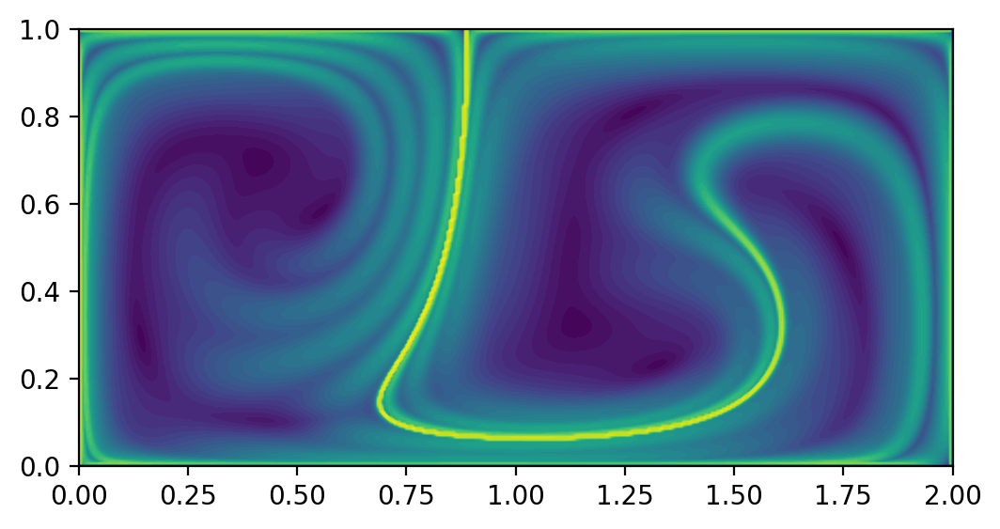
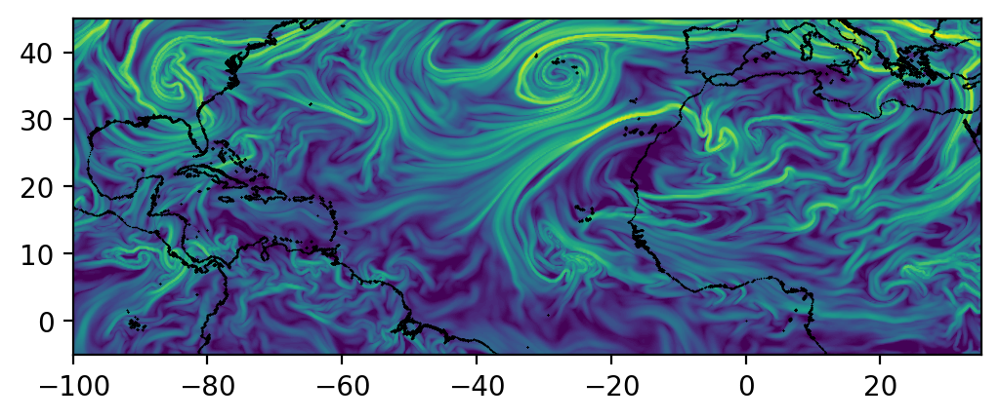

# NumbaCS

**Documentation:** [https://numbacs.readthedocs.io/](https://numbacs.readthedocs.io/en/latest/)

**Source Code (MPL-2.0):** [https://github.com/alb3rtjarvis/numbacs](https://github.com/alb3rtjarvis/numbacs)

NumbaCS (Numba Coherent Structures) is a Python package for performing coherent structure analysis in a user-friendly and efficient manner. It implements methods referred to as "coherent structure methods", an umbrella term for any method that can be used to infer or extract Lagrangian and Eulerian coherent structures. These are tools for performing analysis of time-dependent dynamical systems, mainly with a focus on material transport in fluid flows. While this package can be used with any (incompressible) flow, methods are provided which make it simple for the user to take advantage of these tools for large-scale geophysical flows.

## Features

NumbaCS currently implements the following features:

### Diagnostics:

* **FTLE** -- finite time Lyapunov exponent
* **iLE** -- instantaneous Lyapunov exponent
* **LAVD** -- Lagrangian averaged vorticity deviation
* **IVD** -- instantaneous vorticity deviation

### Feature extraction:

* **LCS** -- hyperbolic and elliptic Lagrangian coherent structures
* **OECS** -- hyperbolic and elliptic objective Eulerian coherent structures
* **Ridge extraction** -- FTLE and iLE ridge extraction

## Installation

Conda:
```
conda install -c conda-forge numbacs
```
Pip:
```
pip install numbacs
```

**_NOTE:_** It is strongly recommended to use conda for installation
due to some reported issues when using pip for one of the dependencies
(see issues [#20](https://github.com/Nicholaswogan/numbalsoda/issues/20)
and [#29](https://github.com/Nicholaswogan/numbalsoda/issues/29)  of the
numbalsoda package -- these seems to primarily affect Windows installations).

## Basic usage

### Predefined flow

```python
import numpy as np
from math import copysign
from numbacs.flows import get_predefined_flow
from numbacs.integration import flowmap_grid_2D
from numbacs.diagnostics import ftle_grid_2D
import matplotlib.pyplot as plt

# set initial time, integration span, and integration direction
t0 = 0.
T = -10.
int_direction = copysign(1, T)

# get ode to be used by 'flowmap_grid_2D'
funcptr, params, domain = get_predefined_flow('double_gyre', int_direction=int_direction)

# set up domain
nx,ny = 401,201
x = np.linspace(domain[0][0], domain[0][1], nx)
y = np.linspace(domain[1][0], domain[1][1], ny)
dx = abs(x[1] - x[0])
dy = abs(y[1] - y[0])

# computes final position of particle trajectories over grid
flowmap = flowmap_grid_2D(funcptr, t0, T, x, y, params)

# compute FTLE over grid
ftle = ftle_grid_2D(flowmap, T, dx, dy)

# plot FTLE
fig, ax = plt.subplots(dpi=200)
ax.contourf(x, y, ftle.T, levels=50)
ax.set_aspect('equal')
plt.show()
```


### Numerical velocity data

```python
import numpy as np
from math import copysign
from numbacs.flows import get_interp_arrays_2D, get_flow_2D
from numbacs.integration import flowmap_grid_2D
from numbacs.diagnostics import ftle_grid_2D
import matplotlib.pyplot as plt

# load in atmospheric data
dates = np.load('../data/merra_june2020/dates.npy')
dt = (dates[1] - dates[0]).astype('timedelta64[h]').astype(int)
t = np.arange(0, len(dates)*dt, dt, np.float64)
lon = np.load('../data/merra_june2020/lon.npy')
lat = np.load('../data/merra_june2020/lat.npy')

# NumbaCS uses 'ij' indexing, most geophysical data uses 'xy'
# indexing for the spatial coordintes. We need to switch axes and
# scale by 3.6 since velocity data is in m/s and we want km/hr.
u = np.moveaxis(np.load('../data/merra_june2020/u_500_800hPa.npy'),1, 2)*3.6
v = np.moveaxis(np.load('../data/merra_june2020/v_500_800hPa.npy'),1, 2)*3.6
nt,nx,ny = u.shape

# set domain on which ftle will be computed
dx = 0.2
dy = 0.2
lonf = np.arange(-100, 35+dx, dx)
latf = np.arange(-5, 45+dy, dy)

# set integration span and integration direction
day = 16
t0_date = np.datetime64("2020-06-{:02d}".format(day))
t0 = t[np.nonzero(dates == t0_date)[0][0]]
T = -72.0
params = np.array([copysign(1, T)])

# get interpolant arrays of velocity field
grid_vel, C_eval_u, C_eval_v = get_interp_arrays_2D(t, lon, lat, u, v)

# retrieve flow and set spherical = 1 since flow is on spherical domain
# and lon is from [-180, 180)
funcptr = get_flow_2D(grid_vel, C_eval_u, C_eval_v, spherical=1)

# compute final position of particle trajectories over grid
flowmap = flowmap_grid_2D(funcptr, t0, T, lonf, latf, params)

# compute FTLE over grid
ftle = ftle_grid_2D(flowmap, T, dx, dy)

# plot coastlines and FTLE
coastlines = np.load('../data/merra_june2020/coastlines.npy')
fig,ax = plt.subplots(dpi=200)
ax.scatter(
    coastlines[:,0], coastlines[:,1], 1, 'k', marker='.', edgecolors=None, linewidths=0
)
ax.contourf(lonf, latf, ftle.T, levels=80, zorder=0)
ax.set_xlim([lonf[0], lonf[-1]])
ax.set_ylim([latf[0], latf[-1]])
ax.set_aspect('equal')
plt.show()
```



## Key dependencies

NumbaCS is built on top of three main packages: [Numba](https://numba.pydata.org), [numbalsoda](https://github.com/Nicholaswogan/numbalsoda), and [interpolation](https://www.econforge.org/interpolation.py/). Numba is a JIT-compiler for Python array and numerical functions that generates optimized machine code just-in-time (using the LLVM compiler library) to significantly speed up numerical operations in Python. Numbalsoda is a Python wrapper to ODE solvers in both C++ (LSODA) and FORTRAN (DOP853) that is compatible with Numba (standard Python ODE solvers cannot be used within Numba functions) and bypasses the Python interpreter, speeding up the most computationally expensive piece of Lagrangian coherent structure methods, particle integration. The interpolation package is a Numba-compatible package which optimizes interpolation in Python. It is used in NumbaCS to generate JIT-compiled interpolant functions of numerical velocity fields which can be fed into solvers from the numbalsoda package, resulting in efficient particle integration for flows defined by numerical velocity data. All of this interfacing, which is done behind the scenes through modules the user can call in a straightforward manner, is how NumbaCS achieves impressive speeds while maintaining a relatively simple user experience. We are grateful to the creators, maintainers, and contributors of each of these packages, as well as the other dependencies which NumbaCS relies on ([NumPy](https://numpy.org/), [SciPy](https://scipy.org/), and [ContourPy](https://contourpy.readthedocs.io/en/v1.3.0/)).

## Roadmap

Future releases aim to extend certain methods to higher dimensions, implement new features that should be straightforward within this framework (shape coherent sets, lobe dynamics, etc.), and further streamline and optimize the process for large-scale geophysical applications.

## Contributing

Pull requests are welcome. For major changes, please open an issue first
to discuss what you would like to change.

Please make sure to update tests as appropriate. See the [Contributing guide](https://numbacs.readthedocs.io/en/latest/contributing.html)
for more details.

## Similar software

This section lists similar packages, their functionality, what ODE solvers are available (and what language they are implemented in), and the available interpolation routines. For performance comparisons of *some* packages on core functionality, see the [Benchmark](https://github.com/alb3rtjarvis/coherent_benchmarks) repository.

---

[`Lagrangian`](https://lagrangian.readthedocs.io/en/latest/index.html) --
Python package for computing FSLE, FTLE, and eigenvectors of Cauchy-Green tensor with a
focus on geophysical flows. Only works with NetCDF files for velocity data.
Largely written in C++ with pybind11 used for binding, resulting in fast
runtimes.
- *Features*: FTLE, FSLE, Cauchy Green eigenvectors
- *Integration*: RK4 (C++)
- *Interpolation*: Linear

[`Dynlab`](https://github.com/hokiepete/dynlab) --
Object oriented Python package
which computes Lagrangian and Eulerian diagnostics along with ridge extraction.
Provides a large collection of predefined flows and is very user friendly.
- *Features*: FTLE, iLE, Trajectory repulsion rate, FTLE ridge extraction, iLE ridge extraction
- *Integration*: LSODA (Python)
- *Interpolation*: N/A

[`TBarrier`](https://github.com/haller-group/TBarrier) --
Collection of Jupyter
notebooks accompanying the book *Transport Barriers and Coherent Structures
in Flow Data -- Advective, Diffusive, Stochastic, and Active methods by George
Haller*. Python code which implements a wide variety of Lagrangian
and Eulerian diagnostics and extraction methods for a variety of different
transport settings, in both 2 and 3 dimensions (NumbaCS currently only
implements purely advective methods in 2D).
- *Features* (both 2D and 3D): FTLE, iLE, variational hyperbolic LCS and OECS, variational elliptic LCS and OECS, variational parabolic LCS, active hyperbolic LCS and OECS, active elliptic LCS and OECS, DBS, diffusive and stochastic elliptic LCS and OECS
- *Integration*: RK4 (Python)
- *Interpolation*: Linear in time, cubic in space

[`Newman`](https://github.com/RossDynamics/Newmanv3.1) --
Fast C++ code for computing FTLE which works with geophysical flows and storm
tracking. Velocity data must be raw binary or ASCII format. No longer maintained.
- *Features* (both 2D and 3D): FTLE, Cauchy Green eigenvectors
- *Integration*: RK45, RK4, Euler (C++)
- *Interpolation*: Linear

[`Aquila-LCS`](https://github.com/ChristianLagares/Aquila-LCS) --
Python code designed to compute FTLE for high-speed turbulent boundary layers in 3D.
Utilizes Numba to implement GPU and CPU versions of the code for fast runtimes.
- *Features* (both 2D and 3D): FTLE, FSLE
- *Integration*: Euler (Python/Numba)
- *Interpolation*: Linear

[`CoherentStructures.jl`](https://coherentstructures.github.io/CoherentStructures.jl/stable/) --
Julia toolbox for computing LCS/FTCS in aperiodic flows. Implements elliptic
LCS methods, FEM-based methods (FEM approximation of dynamic Laplacian for FTCS
extraction), and Graph Laplacian-based methods (spectral clustering and
diffusion maps for coherent sets).
- *Features*: FTLE, finite time coherent sets (via both FEM approximation of dynamic Laplacian and graph Laplacian-based methods), variational elliptic LCS and OECS, diffusive and stochastic elliptic LCS and OECS
- *Integration*: DifferentialEquations.jl, a very advanced and efficient suite of DE solvers (Julia)
- *Interpolation*: Linear, cubic, B-Spline

[`LCS Tool`](https://github.com/haller-group/LCStool) --
MATLAB code used to compute elliptic LCS, hyperbolic LCS, and FTLE.
- *Features*: FTLE, variational hyperbolic LCS, variational elliptic LCS
- *Integration*: ode45 - based off of RK5(4) due to Dormand and Prince (MATLAB)
- *Interpolation*: Linear, cubic

[`LCS MATLAB Kit`](https://dabirilab.com/software) --
MATLAB GUI for computing FTLE from a time series of 2D velocity data. Has FTLE
implementation for intertial particles as well (iFTLE).
- *Features*: FTLE, iFTLE
- *Integration*: Version 1.0 -- RK4 (MATLAB), Version 2.3 -- Euler (MATLAB)
- *Interpolation* Version 1.0 -- Cubic, Version 2.3 -- Linear

[`NumbaCS`](https://numbacs.readthedocs.io/en/latest/) --
Numba accelerated Python package which efficiently computes a variety of
coherent structure methods.
- *Features*: FTLE, iLE, FTLE ridge extraction, variational hyperbolic LCS and OECS, LAVD-based elliptic LCS, IVD-based elliptic OECS, flow map composition
- *Integration*: DOP853 (FORTRAN), LSODA (C++)
- *Interpolation*: Linear, cubic

## Acknowledgments

This work was partially supported by the National Science Foundation (NSF) under
grant number 1821145 and the National Aeronautics and Space Administration
(NASA) under grant number 80NSSC20K1532 issued through the Interdisciplinary
Research in Earth Science (IDS) and Biological Diversity & Ecological
Conservation programs.
