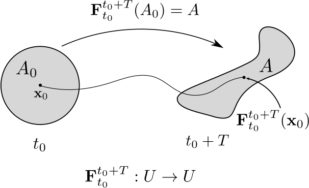
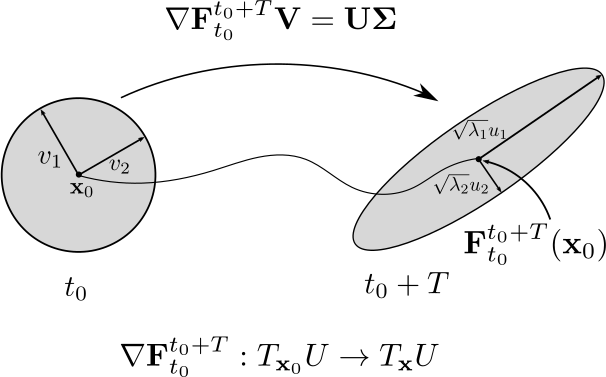

Theory and Implementation
=========================

This section is meant to provide an overview of the theory behind the methods
implemented in NumbaCS and give a brief, informal description of how they are
implemented. It is not meant to be exhaustive but simply meant to get
the user up to speed if these methods are new to them. For more background, 
details, and rigorous derivations, refer to the cited papers in each section.
Additionally, the recent book by Haller :cite:`haller_2023` provides a
self-contained and detailed treatment of all of the methods implemented in
NumbaCS.

Introduction
------------

Understanding material transport in geophysical flows is of great importance in
a variety of applications (oil spill in the ocean, developing search and rescue
strategies for a person lost at sea, dust or smoke transport through the
atmosphere, etc.). Over the last few decades, the theory of
**Lagrangian coherent structures (LCS)** has been developed with a focus on
solving this very problem. The theory extends ideas and objects from autonomous
dynamical systems theory (stable/unstable manifolds, fixed points, periodic
orbits, etc.) in which the systems are time-independent and defined for all time
(allowing one to look at asymptotic properties of the flow), to flows with
general time-dependence, which may only be defined or known for some finite time
window. By doing this, important organizing structures can be identified which
deliniate dynamically distinct regions of a flow and provide insight into the
complicated dynamics of these highly time-dependent flows. More recently,
**objective Eulerian coherent structures (OECS)** have been defined which can be
thought of as the instantaneous limit of LCS and provide a quick-to-compute
approach to identify influential short-time, objective structures which only
depend on velocity data at the current instant.

The term coherent structures has been used to describe a variety of patterns
within a fluid flow that influence the transport of some tracer in that flow,
sometimes without precise definition. In NumbaCS, coherent structures are
defined in the sense of Lagrangin coherent structures (in the finite time case),
and objective Eulerian coherent structures (in the instantaneous case). These
are objective (i.e. frame-invariant) influential material curves (in a 2D flow)
or surfaces (in a 3D flow) which play a major role in organizing the contents of
that flow over some finite time window (or time instant). These structures are
precisely defined as will be detailed below. 

To define these structures, consider the
following initial value problem, viewed as a dynamical system over some general
*n*-dimensional smooth manifold :math:`\mathcal{M}`,

.. math::
   :label: ds
   
   \dfrac{d}{dt}\mathbf{x} &= \mathbf{v}(\mathbf{x},t), \qquad \mathbf{x} \in U \subset \mathcal{M}, \quad t\in I \subset \mathbb{R}\\
   \mathbf{x}(t_0)  &= \mathbf{x}_0

Then, there exists a family of diffeomorphisms :math:`\{\mathbf{F}^t_{t_0}\}`
(known as the flow maps) associated with the dynamical system given by,

.. math::
   :label: flowmap
   
   \mathbf{F}^t_{t_0} &: I \times I \times U\rightarrow U\\
   &: \mathbf{x}(t_0;t_0,\mathbf{x}_0) \mapsto \mathbf{x}(t;t_0,\mathbf{x}_0)
   

in which either :math:`t>t_0` (mapping forward in time) or :math:`t<t_0`
(mapping backwards in time).

To extract important objective features from the flow map, we define the right
Cauchy-Green deformation tensor in terms of the linearized flow map,

.. math::
   :label: C
   
   \mathbf{C}^{t_0+T}_{t_0}(\mathbf{x}_0) = (\nabla\mathbf{F}^{t_0+T}_{t_0})^{\top} \nabla\mathbf{F}^{t_0+T}_{t_0}(\mathbf{x}_0)

where :math:`\nabla` represents the derivative with respect to the initial 
position :math:`\mathbf{x}_0` (i.e. the gradient) and :math:`T=t-t_0` is the
flow map duration or so-called integration time (which could be positive or 
negative). The matrix :math:`\mathbf{C}^{t_0+T}_{t_0}(\mathbf{x}_0)` is
symmetric and positive-definite with real eigenvalues :math:`\lambda_i` and
corresponding orthonormal eigenvectors :math:`\mathbf{\xi}_i` with :math:`i \in
\{1,2,...,n\}` such that,

.. math::
   :label: C_eig
   
   &\lambda_n\geq...\geq \lambda_1 > 0 \; \text{and},\\
   & \left<\mathbf{\xi}_i,\mathbf{\xi}_j\right> = \delta_{ij}.
   
To extract important objective features from the velocity field itself, we
define the Eulerian rate of strain tensor in terms of the gradient of the
velocity field,

.. math::
   :label: S
   
   \mathbf{S}(\mathbf{x}_0,t) = \dfrac{1}{2} \left(\nabla \mathbf{v}(\mathbf{x}_0,t) + \mathbf{v}(\mathbf{x}_0,t)^{\top} \right).
   
The matrix :math:`\mathbf{S}(\mathbf{x}_0,t)` is symmetric with real eigenvalues
:math:`s_i` and corresponding orthonormal eigenvectors :math:`\mathbf{e}_i` with
:math:`i \in \{1,2,...,n\}` such that,

.. math::
   :label: S_eig
   
   & s_n\geq...\geq s_1 \; \text{and},\\
   & \left<\mathbf{e}_i,\mathbf{e}_j\right> = \delta_{ij}.
   
   
Hyperbolic LCS
--------------

Hyperbolic LCS are dominant attracting and repelling material curves which, as
their names suggest, attract or repell nearby particles maximally, in a local
sense. To define these structures, note that, given the above description,
the linearized flow map provides a linear approximation of the action of the
flow map on an infinitesmal *n*-sphere. The eigenvector corresponding to the
largest eigenvalue, :math:`\xi_n`, represents the directions in which an
infinitesmal perturbation to the initial condition will grow the most (and a
perturbation in the :math:`\xi_1` direction will shrink the most). Each
eigenvalue, :math:`\lambda_i` will give the square of the magntitude of growth
(or contraction) in the :math:`\xi_i` direction over the time window
:math:`[t_0,t_0+T]`. This behavior can equivalently be seen through the SVD of
the linearized flow map as shown below.

|pic1| |pic2|

   

The figure on the left shows the action of the flow map on a small circle and
the figure on the right shows the linear approximation.
Let :math:`\nabla\mathbf{F}_{t_0}^{t_0 + T} = \mathbf{U\Sigma V^*}` be the SVD
of the linearized flow map. The singular values (diag (:math:`\mathbf{U}`)) are
equal to the square root of the eigenvalues (:math:`\sqrt{\lambda_i}`) of
:math:`\mathbf{C}^{t_0+T}_{t_0}` and the right singular vectors (:math:`v_i`)
are equal to the eigenvectors (:math:`\xi_i`) of
:math:`\mathbf{C}^{t_0+T}_{t_0}`.

.. note::

   The flow map acts on elements of the domain and maps them to the domain. Its
   action on a set can be defined in the following manner: 
   :math:`\mathbf{F}^{t_0 + T}_{t_0}(A_0) := \{\mathbf{F}^{t_0 + T}_{t_0}(\mathbf{x}_0) \in U | \mathbf{x}_0 \in A_0\}`.
   The derivative of the flow map, :math:`\nabla\mathbf{F}^{t_0+T}_{t_0}`, acts
   on elements of the tangent space (i.e. vectors) and maps them to elements
   of the tangent space downstream at
   :math:`\mathbf{x}=\mathbf{F}_{t_0}^{t_0 + T}(\mathbf{x}_0)`.

FTLE
^^^^

The **finite time Lyapunov exponent (FTLE)**, a finite time version of the
classic Lyapunov exponent, is defined as,

.. math::
   :label: ftle
   
   \sigma_{t_0}^{t_0+T}(\mathbf{x}_0) = \frac{1}{2\left|T\right|}\log(\lambda_{n}).  

FTLE was the first proposed method to find LCS :cite:`haller1998`,
:cite:`haller2001`, :cite:`shadden2005` and remains a preferred method by many
due to its relative simplicity to compute and its robustness to uncertainty in
the underlying velocity data :cite:`badza2023`. Regions of high FTLE are good
indicators of repelling LCS in forward time and attracting LCS in backward time.
By extracting ridges from the FTLE field, one can obtain the sought after
hyperbolic structures.

Variational LCS
^^^^^^^^^^^^^^^

Haller then proposed the variational theory of hyperbolic LCS :cite:`haller2011`
in which he defines LCS as material curves (or surfaces in 3D) that are
maximally repelling or attracting, normal to the curve, over the finite time
window of interest and relative to nearby material curves. Here we give their
definition in 2D. Given we have a dynamical system as in eq :eq:`ds` with
flowmap :eq:`flowmap` and resulting eigenvalues and eigenvectors of
:math:`\mathbf{C}^{t_0+T}_{t_0}(\mathbf{x}_0)` as in :eq:`C_eig`, let
:math:`\gamma^*(t) \in U` be a compact material curve which evolves over the
interval :math:`[t_0,t_0+T]`. Then, :math:`\gamma^*(t)` is a **repelling LCS**
(if :math:`T>0`) or **attracting LCS** (if :math:`T<0`) if and only if the
following conditions hold for all :math:`\mathbf{x}_0 \in \gamma^*(t_0)`:

A. :math:`\lambda_1 (\mathbf{x}_0) \neq \lambda_2 (\mathbf{x}_0) >1;`
#. :math:`\left< \mathbf{\xi}_2 (\mathbf{x}_0), \nabla^2 \lambda_2(\mathbf{x}_0) \mathbf{\xi}_2 (\mathbf{x}_0) \right> \leq 0;`
#. :math:`\mathbf{\xi}_1 (\mathbf{x}_0) || \gamma^*(t_0);`
#. :math:`\overline{\lambda}_2 (\gamma)`, the average of :math:`\lambda_2` over a curve :math:`\gamma`, is maximal on :math:`\gamma^*(t_0)` among all nearby curves :math:`\gamma` satisfying :math:`\gamma || \mathbf{\xi}_1 (\mathbf{x}_0).`

Farzmand and Haller :cite:`farazmand2012` detail how to implement this theory
numerically and the NumbaCS implementation follows this paper quite closely,
with deviations on how initial conditions are choosen and some additional
options for the user when it comes to comparing candidate LCS. In short,
solution curves are computed in the minimum eigenvector field :math:`\xi_1`
(satisfying C) until conditions A,B are not satisfied for some continuous
predefined length. Then, nearby solution curves obtained in this manner are
compared to satisfy condition D.

.. note::
   The numerical implementation of the variational method for hyperbolic LCS
   yields accurate, smooth curves and is the direct implementation of their
   definition, but this comes at the expense of a somewhat significant increase
   in computational cost and additional complexity for the user as, typically,
   parameters in the implementation need to be in a somewhat narrow window to
   produce satisfactory LCS. There is no way of determining these parameters
   *a priori* and therefore this challenge is passed to the user in a trial and
   error fashion. For this reason, it is generally suggested to use one of the
   *FTLE ridge* methods described below.
   
   
FTLE ridges
^^^^^^^^^^^

As mentioned previously, FTLE ridges often coincide with hyperbolic LCS and
therefore, extracting FTLE ridges themselves can serve as an alternative to the
variational method for hyperbolic LCS. It should be noted, that there are cases
when FTLE ridges can result in false positives due to regions of high shear
:cite:`haller2001b`, :cite:`haller2011` but these ridges can be filtered out by
checking additional criteria. In addition, it is not a gaurentee that every
hyperbolic LCS will be along a FTLE ridge and therefore the ridge methods could
potentially miss some hyperbolic LCS. In practice, very often FTLE ridges are
indeed hyperbolic LCS and the FTLE ridge method picks up most of the dominant
structures.

The simplest approach to identify FTLE ridges is to simply threshold the FTLE
field. By only looking at FTLE values above a certain threshold, regions of high
attraction and repulsion can be obtained in a very straightforward manner. This
does not result in a true codimension-1 ridge though as, in a 2D flow, a 2D
region will generally be returned in which a true ridge resides. When one simply
desires a visual of influential regions, this can be a good first step.
Sometimes actual ridges are desired for a variety of reasons. With a ridge,
quantities normal and tangent to the ridge can be computed and tracking of
specific ridges is possible. Below we detail the methods used to extract these
ridges.

FTLE ridge extraction methods follow the methods developed in the image
processing community designed to extract ridges from images. In image
processing, images are usually converted to gray scale and the gray values are
essentially used as a discrete height function. Most methods suggest smoothing
the data with a Gaussian, providing a scale-space representation. From there,
first and second derivatives of this height function are computed, often with
derivatives of the Gaussian, and these derivatives are used to extract
differential geometric properties of the height field. These ridges are often
referred to as height ridges (or sometimes, a *second-derivative ridge*).
Given a height function :math:`f` in 2 dimensions, **height ridge** points are
defined as all :math:`\mathbf{x}_0 \in U` such that,

#. :math:`\left<\nabla f,\eta_{max}\right> = 0`;
#. :math:`\left<\eta_{max},H_{f}\cdot \eta_{max} \right> < 0`

where :math:`H_f` denotes the Hessian of :math:`f` at :math:`\mathbf{x}_0`,
:math:`\eta_{max}` is the eigenvector of the Hessian corresponding to the
largest (in magnitude) eigenvalue (representing the direction normal to the
ridge), and it is implied that all quantities are evaluated at
:math:`\mathbf{x}_0`. The first condition guarantees that the point is at an
extrema of :math:`f` (in the :math:`\eta_{max}` direction) and the second,
that :math:`f` is concave down (in the :math:`\eta_{max}` direction).
Shadden et al. :cite:`shadden2005` first defined second-derivative FTLE ridges
with these ideas in mind, using the FTLE field :math:`\sigma` as the height
field. Later Haller :cite:`haller2011` defined FTLE ridges in a similar fashion
to height ridges but required :math:`\nabla \lambda_2` be tangent to the ridge
and replaced :math:`\eta_{max}` with :math:`\xi_2` in the second condition.
Finally, Schindler et al :cite:`schindler2012` further refined the criteria by
using :math:`\xi_2` in the first condition (they referred to these as
**C-ridges**), resulting in the most common defintion of **FTLE ridges** today,

#. :math:`\left<\nabla \sigma,\xi_{2}\right> = 0`;
#. :math:`\left<\xi_2,H_{\sigma}\cdot \xi_{2} \right> < 0`.

In a numerical context, finding points which satisfy condition 1 is challenging
as a grid point will rarely be exactly on a ridge. If this condition is applied
in a strict sense, often very few points will be identified as ridge points. If
condition 1 is relaxed and instead the inner product is required to be below
some tolerance in magnitude, points around (and sometimes on) a ridge are often
found. Neither of these results are desirable. A contour generatoring algorithm
is sometimes suggested (e.g. marching squares) to find zero curves of condition
1 but this comes with its own issues due to the orientation discontinuities of
the eigenvector field. To get around these issues, NumbaCS
follows an approach used by Steger :cite:`steger1998` to extract ridges from
images. This approach obtains ridge points with subpixel accuracy by Taylor
expanding the height field at a grid point and using this expansion to find the
zero of condition 1. In addition, NumbaCS follows the approach in Steger to link
and order points which belong to the same ridge. NumbaCS also adds an additional
step that connects ridges together if an endpoint of each is within some
tolerance and the angle between the vector connecting the endpoints and the
tangent at each endpoint is below another tolerance.

.. note::
   An approach first proposed by Mathur et al. :cite:`mathur2007`, and later
   revisted by Senatore and Ross :cite:`senatore2011` using a scale-space
   representation, called *dynamical sharpening* is another way to obtain
   accurate FTLE ridges that uses the fact the FTLE ridges are attractors of
   the gradient dynamical system given by,
   
   .. math::
   
      \dfrac{d\mathbf{x}_0}{ds} = \nabla \sigma(\mathbf{x}_0).
      
   While this approach does yield accurate ridges, we found that the approach
   implemented in NumbaCS achieves roughly the same level of accuracy at a
   significantly lower computational cost. 

What conditions guarentee that a FTLE ridge is a hyperbolic LCS? Haller gave
some conditions in :cite:`haller2011` which would guarentee this and later,
Karrasch :cite:`karrasch2012` further simplified these conditions in the case of
differentiable eigenvectors. He showed that, given :math:`\gamma` is a FTLE
ridge as defined above, if all :math:`\mathbf{x}_0 \in \gamma` satisfy
conditions A and C from the variational definition for hyperbolic LCS, then
:math:`\gamma` is a hyperbolic LCS. Given that :math:`\nabla \sigma`
approximates the tangent to the ridge and that :math:`\xi_1 \perp \xi_2`,
condition C is satisfied in an approximate sense and then the method employed
simply needs to only consider points at which :math:`\sigma > 0` (equivalent to
condition A).

Hyperbolic OECS
---------------

Hyperbolic OECS are defined in a similar manner to hyperbolic LCS but instead of
being tied to some integration time and finite time window, they are
instantaneous structures derived the velocity field at a specific instant in
time. Much like hyperbolic LCS, they are domainant attracting and repelling
material lines which have a great deal of influence over short time dynamics.
Defined by Serra and Haller :cite:`serra2016`, they are derived
from the Eulerian rate of strain tensor as introduced in :eq:`S` and serve as
cores of short term hyperbolic behavior.

Variational OECS
^^^^^^^^^^^^^^^^

Much like the variational theory for hyperbolic LCS, hyperbolic OECS are defined
as solution curves in the eigenvector fields from
:math:`\mathbf{S}(\mathbf{x}_0,t)`. The properties which define them are
somewhat different though and described below. From :cite:`serra2016`,
**repelling OECS** at time *t* are solution curves in the :math:`\mathbf{e}_1`
field such that the curve contains a local maxima of :math:`s_2` but contains
no other local maxima of :math:`s_2`. **Attracting OECS** at time *t* are
solution curves in the :math:`\mathbf{e}_2` field such that the curve contains
a local minimum of :math:`s_1` but contains no other local minima of
:math:`s_1`. In the case of an incompressible 2D flow, :math:`s_1 = -s_2` so
their extrema will conincide. Therefore, the sought after structures are
referred to as *objective saddle points* (generalizing the notion of classic
saddle points in time-independent flows) and highlight cores of short term
hyperbolic behavior. To compute them, identify all local maxima above a
certain threshold, integrate in each eigenvector field until the magnitude of
the instantaneous attraction (or repullsion) rate is not longer monotonically
decreasing or the curve is longer than a preset length.

iLE
^^^

A few years later, Nolan et al. :cite:`nolan2020` showed that, in the limit as
integration time goes to zero, the FTLE converges to the eigenvalues of the
Eulerian rate of strain tensor with its sign determined by which direction the
limit is taken it. They referred to this as the 
**instantaneous Lyapunov exponent (iLE)** and defined it as,

.. math::
   \lim_{T \to 0^{\pm}} \sigma_{t_0}^{t_0+T}(\mathbf{x}_0) = \pm s_{\pm}(\mathbf{x}_0,t_0)
   
where the :math:`\pm` denotes which direction the limit is taken in and the
maximum and minimum eigenvalues of :math:`\mathbf{S}(\mathbf{x}_0,t)`
respectively. The iLE is meant to serve as a diagnostic (like the FTLE does in
the finite time case) in the instantaneous case. Like the FTLE field, they
defined iLE ridges in the same manner as they were defined in 
:ref:`theory:ftle ridges` with the FTLE field being replaced by the :math:`s_1`
or :math:`s_2` field and the eigenvector of
:math:`\mathbf{C}^{t_0+T}_{t_0}(\mathbf{x}_0)` replaced by the corresponding
eigenvector of :math:`\mathbf{S}(\mathbf{x}_0,t)`.

Elliptic LCS
------------

Elliptic LCS are closed material curves which bound sets that remain coherent
under the action of the flow. First defined by Haller and Beron-Vera
:cite:`haller2013` using a variational formulation, these are closed curves
which uniformly stretch or contract by the same factor over some finite time
window of interest. Computing these structures using the variational formulation
comes with some challenges which we will not address here as we do not
implement this method. Later, Serra and Haller :cite:`serra2017` proposed a
simpler and more efficient algorithm which uses the fact that these curves
are closed null geodesics of the appropriate Lorentzian metrics. This approach
improves on the numerical implementation of the variational approach by
providing a simpler algorithm with greater efficiency. Shortly before this work,
Haller et al. :cite:`haller2016` defined the Lagrangian averaged vorticity
deviation (LAVD) and provided yet another way to identify elliptic LCS. NumbaCS
implements this approach as we found it to be the most efficient. 

LAVD
^^^^

The LAVD is an objective quantity used to find rotationally coherent Lagrangian
vortices in a flow, whose boundaries coincide with elliptic LCS. Given a system
:eq:`ds` with corresponding flow map :eq:`flowmap`, the vorticity at any point
:math:`\mathbf{x} \in U` is given by
:math:`\mathbf{\omega} = \nabla \times \mathbf{v}(\mathbf{x},t)`. Then, the
instantaneous spatial mean of vorticity is given by,

.. math::
   
   \mathbf{\bar{\omega}}(t) = \frac{\int_U \mathbf{\omega}(\mathbf{x},t)dV}{\text{vol}(U)}
   
where vol(:math:`\cdot`) represents the volume (in 3D) or the area (in 2D) and
:math:`dV` represents either a volume or area element. Then, the **LAVD** is
defined as,
 
.. math::
   :label: lavd
   
   \text{LAVD}_{t_0}^{t}(\mathbf{x}_0) := \frac{1}{|t - t_0|} \int_{t_0}^{t} |\mathbf{\omega}(\mathbf{x}(s,\mathbf{x}_0),s) - \bar{\mathbf{\omega}}(s) | ds.

To extract rotationally coherent vortices, local maxima of the LAVD field are
identifed and the outermost convex closed level curves around each of these local
maxima are extracted. The maxima are referred to as
**LAVD-based vortex centers** and the outermost curves are referred to as
**LAVD-based elliptic LCS**. Due to numerical inaccuracies and potential
precision issues in the algorithm choosen to extract the level curves, often
curves are not required to be strictly convex but have a very small convexity
deficiency. NumbaCS implements this method and measures convexity deficiency by
computing the relative difference in area between the candidate curve and its
convex hull.

Elliptic OECS
-------------

Like the hyperbolic case, elliptic LCS have Eulerian counterparts defined in
very similar ways but in terms of eigenvalues and eigenvectors of
:math:`\mathbf{S}(\mathbf{x}_0,t)` instead of 
:math:`\mathbf{C}^{t_0+T}_{t_0}(\mathbf{x}_0)`. In the Serra and Haller paper
:cite:`serra2017`, they show, by replacing the right Cauchy Green deformation 
tensor with the Euerian rate of strain tensor, that the null geodesic
approach works for the Eulerian case as well. In the Haller et al. paper
:cite:`haller2016` on LAVD, they also define a quantity for the Eulerian case,
the instantaneous vorticity deviation (IVD). Like the LAVD, the outermost closed
convex level curves can be used to extract elliptic OECS. NumbaCS implements
this approach.

IVD
^^^

The **IVD** is defined as,

.. math::
   :label: ivd
   
   \text{IVD}(\mathbf{x},t) := |\mathbf{\omega}(\mathbf{x},t) - \bar{\mathbf{\omega}}(t)|
  
and it can be shown that the IVD is the limit of the LAVD as integration time
goes to zero. The outermost closed convex level curves can be extracted in the
same manner as is done for LAVD. The maxima are referred to as **IVD-based
vortex centers** and the outermost curves are referred to as **IVD-based
elliptic OECS**.

Flow map Composition
--------------------

Typically, the most expensive portion of any finite-time coherent strucrure
method is the step of particle integration required to solve :eq:`ds` and obtain
flow maps :eq:`flowmap`. If the coherent structure quantity to be computed is
only desired at a single instant, there is not much one can do to cheapen this
step aside from using more efficient solvers, relaxing error tolerances, or
using a coarser grid. Often, the quantity of interest is desired in a time
series though, rather than at just a single frame. When this is the case,
Brunton and Rowley :cite:`brunton2010` noted that redundent computation is being
performed in the particle integration step that could be circumvented by
interpolating the flow map (see Figure 1 in the cited article for a clear
picture of the redundancy). This is done by exploiting the semigroup property of
the flow maps defined in equation :eq:`flowmap`,

.. math::
   :label: flowmap_comp
   
   \mathbf{F}_{t_0}^{t_0+T} = \mathbf{F}_{t_{N-1}}^{t_N} \circ \cdot \cdot \cdot \circ \mathbf{F}_{t_1}^{t_2} \circ \mathbf{F}_{t_0}^{t_1}
   
where :math:`t_{N} = t_0 + T` and the associative binary operation is the
composition operation. Therefore, the flow map over some time window
:math:`[t_0,t_0+T]` can be obtained by composing a collection of intermediate 
flow maps of shorter time windows. This is not very useful when only a single
flow map is desired but if a time series of flow maps is needed, this can cut
down the computational cost. Note that if a time series of FTLE was desired for
times :math:`{t_0,t_1,...,t_n}`, derived from flow maps over the following time
windows :math:`{[t_0,t_0+T], [t_1,t_1+T], ... , [t_n,t_n+T]}`, these could be
computed as,

.. math::
   :label: flowmap_comp_series
   
   \mathbf{F}_{t_0}^{t_0+T} &= \mathbf{F}_{t_{N-1}}^{t_{N}} \circ \cdot \cdot \cdot \circ \mathbf{F}_{t_1}^{t_2} \circ \mathbf{F}_{t_0}^{t_1}\\
   \mathbf{F}_{t_1}^{t_1+T} &= \mathbf{F}_{t_{N}}^{t_{N+1}} \circ \cdot \cdot \cdot \circ \mathbf{F}_{t_2}^{t_3} \circ \mathbf{F}_{t_1}^{t_2}\\
   &\vdots \\
   \mathbf{F}_{t_n}^{t_n+T} &= \mathbf{F}_{t_{N+n-1}}^{t_{N+n}} \circ \cdot \cdot \cdot \circ \mathbf{F}_{t_{n+1}}^{t_{n+2}} \circ \mathbf{F}_{t_n}^{t_{n+1}}.

Clearly, for each full flow map :math:`\mathbf{F}_{t_k}^{t_k+T}`, all but the
first intermediate flow map (:math:`\mathbf{F}_{t_k}^{t_{k+1}}`) used to create
this full flow map can be recycled and used to create the succesive flow map
:math:`\mathbf{F}_{t_{k+1}}^{t_{k+1}+T}`. Given that the flow map is being
computed on a grid :math:`\mathcal{G}`, it is necessary to interpolate each
intermediate flow map (after the first) since, in general,
:math:`\mathbf{F}_{t_k}^{t_{k+1}}(\mathcal{G}) \not\rightarrow \mathcal{G}` and
this will be the input to the next intermediate flow map.
Therefore, Brunton and Rowley define the interpolation operator
:math:`\mathcal{I}` which acts on a discrete map
:math:`\mathbf{F}_{\mathcal{G}_k} := \mathbf{F}_{t_k}^{t_{k+1}}(\mathcal{G})`
and returns the interpolated map, i.e.

.. math::
   :label: interp
   
   \mathcal{I}&: \mathbf{F}_{\mathcal{G}_k} \mapsto \mathcal{I}\mathbf{F}_k \quad \text{where} \\
   \mathcal{I}\mathbf{F}_k&: U \rightarrow U
   
and :math:`\mathcal{I}\mathbf{F}_k` is the interpolated flow map
:math:`\mathbf{F}_{t_k}^{t_{k+1}}`.  
Then, for any :math:`t_k \in \{t_0,t_1,...,t_n\}`

.. math::
   :label: interp_comp
   
   \widetilde{\mathbf{F}}_{t_k}^{t_k+T}(\mathcal{G}) &= \mathcal{I}\mathbf{F}_{N+k-1} \circ \cdot \cdot \cdot \circ \mathcal{I}\mathbf{F}_{k+1} \circ \mathbf{F}_{\mathcal{G}_k}\\
   &\approx \mathbf{F}_{t_k}^{t_k+T}(\mathcal{G})

They call this the unidirectional method and also define a bidirectional method.
They show that the bidirectional method is not as accurate or as fast so we
omit any further discussion here. In addition, they suggest an alternative
method for storage of smaller composed intermediate flow maps called the
multi-tier (as opposed to single-tier) method. NumbaCS implements the
single-tier unidirectional method which is what was described above.

.. warning::
   This method achieves the most computational savings when particles mapped
   under the action of the flow do not leave the domain on which the coherent
   structure method is being computed (i.e. if :math:`U_{D} \subset U` is the
   coherent structure domain then 
   :math:`\mathbf{F}\restriction U_{D}: U_{D} \rightarrow U_{D}`). If
   this is not the case, the flow map would need to be computed on a larger
   domain and the computational savings would shrink (and eventually vanish as
   the domain grew). NumbaCS currently only implements the flow map composition
   method when the coherent structure domain is self contained.

References
----------
    
.. bibliography:: refs.bib    
