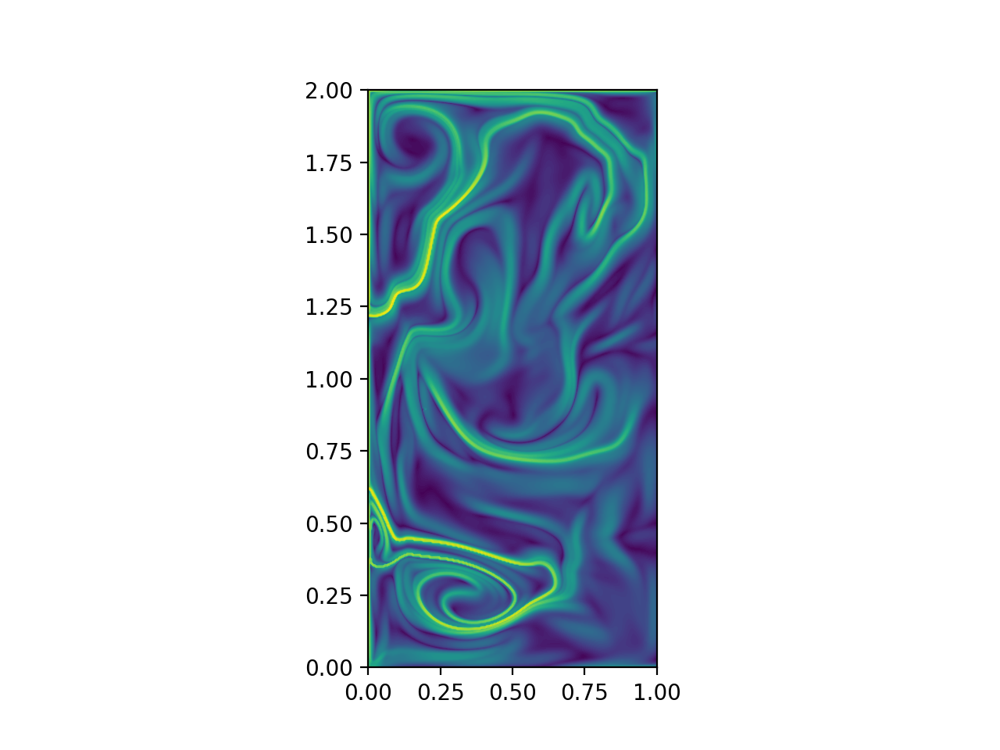
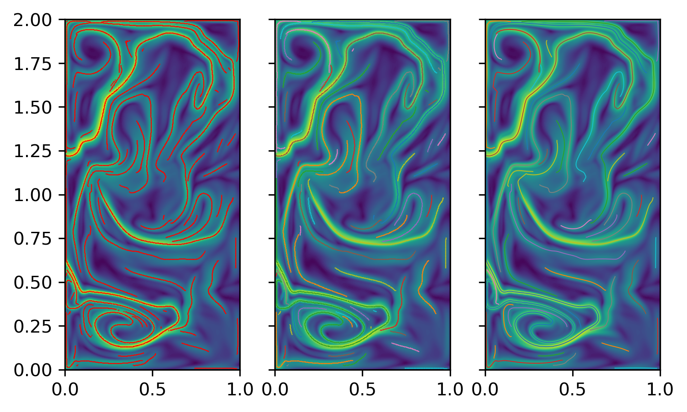
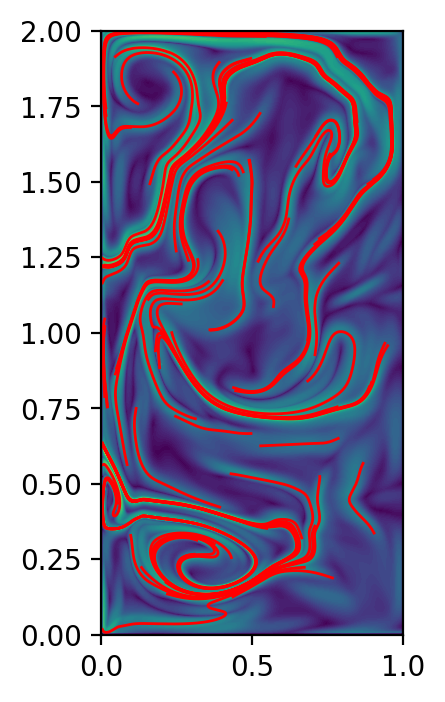
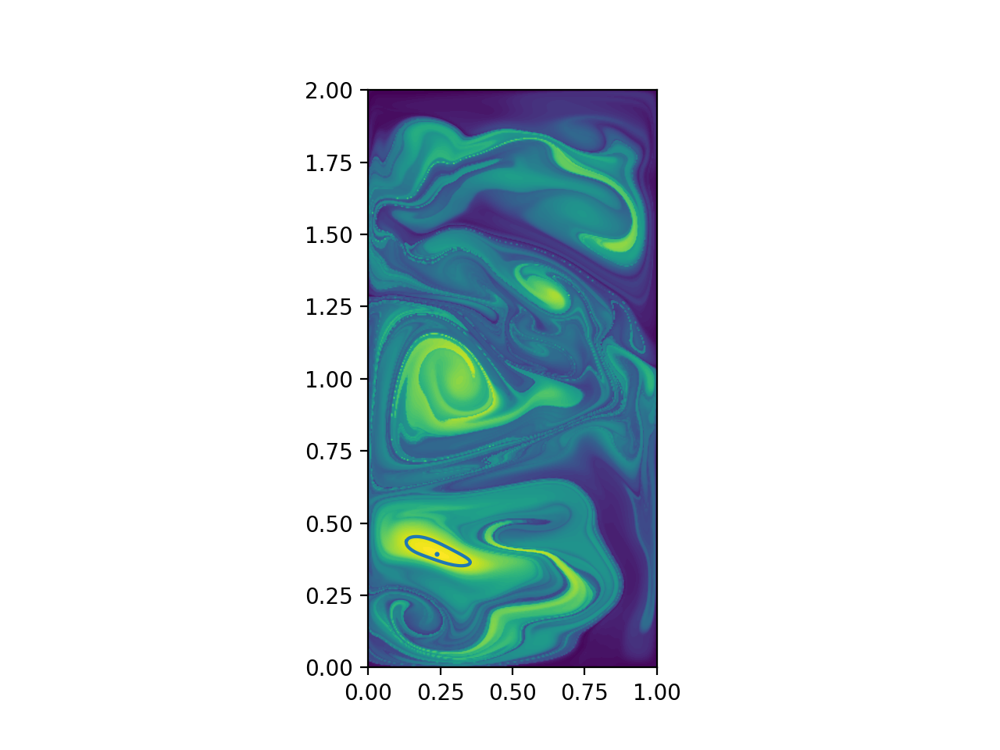
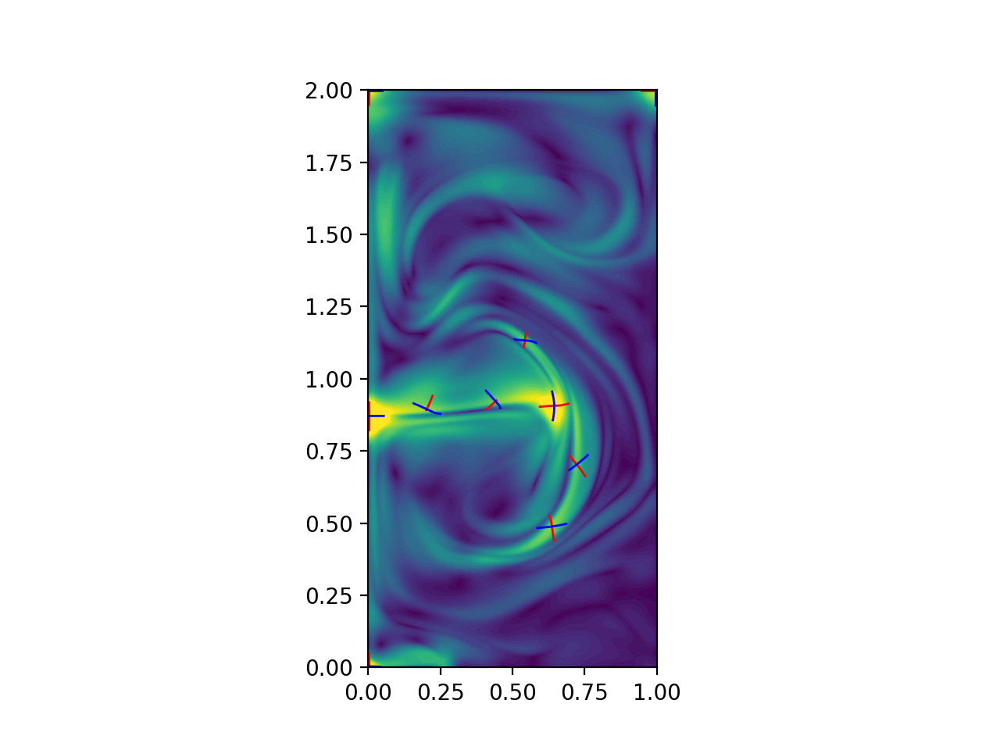
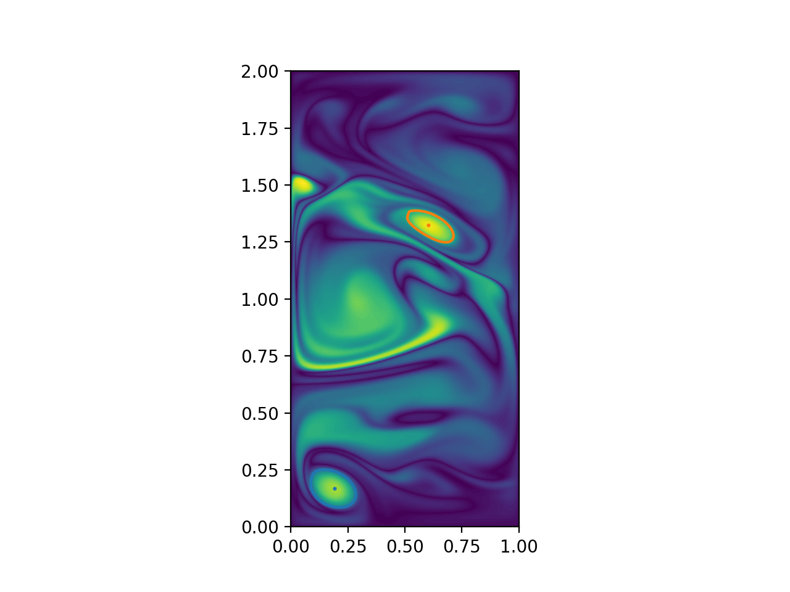

User Guide
==========

This section is meant to get the user aquinted with the functions in NumbaCS and
make the workflow through the modules clear. For a simpler approach to get
started with NumbaCS, a user may be better served by picking an example from the
:ref:`auto_examples/index:examples gallery` to go through and refering to this section as
questions arise. An overview of the theory behind the methods presented here is
covered in the :ref:`theory:theory and implementation` section.

Lagrangian
----------

Performing Lagrangian diagnostics and feature extraction is done using a similar
workflow. First, a flow needs to obtained in a form that works with the ODE
solver used by NumbaCS (numbalsoda). Then, particle integration needs to be
performed over the domain of interest. Following that, one of the methods can be
applied to obtain the desired quantities.

Flows
^^^^^

To begin using NumbaCS for Lagrangian methods, the user needs to define a flow
from which coherent structures will be obtained. This is all done through the
:mod:`numbacs.flows` module. NumbaCS provides predefined flows that the user
can retrieve and a simple interface for generating the interpolants needed
for numerical velocity fields.

Predefined flows
""""""""""""""""

To retrieve a predefined flow, the user can call the
:func:`numbacs.flows.get_predefined_flow` function to get one of the predefined
flows. Currently, the supported flows are "double_gyre", "bickley_jet",
and "abc". To retrieve the "double_gyre" flow,

.. code-block:: python

   # import the function
   from math import copysign
   import numpy as np
   from numbacs.flows import get_predefined_flow

   # define integration time
   T = -10.0
   int_direction = copysign(1, T)

   # get function pointer for 'double_gyre'
   funcptr, params, domain = get_predefined_flow('double_gyre',
   						  int_direction = int_direction
   						  return_default_params = True,
   						  return_domain = True
   						  parameter_description = True)

   # set up grid with nx points in x-direction and ny in y-direction
   nx,ny = 401,201
   x = np.linspace(domain[0][0], domain[0][1], nx)
   y = np.linspace(domain[1][0], domain[1][1], ny)

Predefined flows have parameters in their definition that can be modified. A
default set of parameters can be returned by setting the keyword argument
``return_default_params = True`` (it is True by default). In addition,
by setting ``parameter_description = True`` (it is False by default), a
string will be returned that details what each element of the params array
coincides with in the definition of the ODE for each flow. For reference, the ODE
(streamfunction for bickley jet) corresponding to each flow are listed below.

**Double Gyre**

.. math::
   :label: dg

   \dfrac{dx}{dt} &= -\pi A \sin(\pi f)\cos(\pi y) - \alpha x + \eta\\
   \dfrac{dy}{dt} &= \pi A \cos(\pi f)\sin(\pi y) \dfrac{df}{dx} - \alpha y + \eta\\
   f(x,t) &= \epsilon \sin(\omega t + \psi)x^2 + (1 - 2\epsilon \sin(\omega t + \psi)x).

**Bickely Jet**

.. math::
   :label: bickley

   \psi(x,y,t) = U_0 L(-\tanh(y/L) + \text{sech}^2(y/L&)(A_1 \cos(k_1(x - c_1 t)\\
                                                       &+ A_2 \cos(k_2(x - c_2 t)\\
                                                       &+ A_3 \cos(k_3(x - c_3 t))

**Time-periodic ABC flow**

.. math::
   :label: `abc`

   \dfrac{dx}{dt} &= (A + \alpha\sin(t))\sin(z) + C\cos(y)\\
   \dfrac{dy}{dt} &= B\sin(x) + (A + \alpha\sin(t))\cos(z)\\
   \dfrac{dz}{dt} &= C\sin(y) + B\cos(x)

Numerical flows
"""""""""""""""

To use a numerical velocity field, which could have been obtained either from
numerical simulation or real world data, interpolants need to be created for
the velocity components in each direction. First, the user needs to call
:func:`numbacs.flows.get_interp_arrays_2D`, and then pass the objects returned
from that function into :func:`numbacs.flows.get_flow_2D`.

.. code-block:: python

   # import the function
   from math import copysign
   import numpy as np
   from numbacs.flows import get_interp_arrays_2D, get_flow_2D

   # load in qge velocity data and define domain
   u = np.load('./data/qge/qge_u.npy')
   v = np.load('./data/qge/qge_v.npy')
   nt,nx,ny = u.shape
   x = np.linspace(0,1,nx)
   y = np.linspace(0,2,ny)
   t = np.linspace(0,1,nt)

   # define integration time
   T = -0.05
   params = np.array([copysign(1,T)])

   # get arrays for interpolant
   grid_vel, C_eval_u, C_eval_v = get_interp_arrays_2D(t, x, y, u, v)

   # get function pointer for interpolant of qge velocity data
   funcptr = get_flow_2D(grid_vel, C_eval_u, C_eval_v, extrap_mode='linear')

This will create a cubic interpolant of the velocity field. To create a linear
interpolant, coefficient arrays do not need to computed so there is no need to
call :func:`get_interp_arrays_2D`. The linear interpolant can be obtained by
simply calling :func:`get_flow_linear_2D`.

.. code-block:: python

   # import the function
   from math import copysign
   import numpy as np
   from numbacs.flows import get_flow_linear_2D
   from interpolation.splines import UCGrid

   # load in qge velocity data and define domain
   u = np.load('./data/qge/qge_u.npy')
   v = np.load('./data/qge/qge_v.npy')
   nt,nx,ny = u.shape
   x = np.linspace(0,1,nx)
   y = np.linspace(0,2,ny)
   t = np.linspace(0,1,nt)

   # define integration time
   T = -0.05
   params = np.array([copysign(1,T)])

   # set grid and get function pointer for interpolant of qge velocity data
   grid_vel = UCGrid((t[0],t[-1],nt),(x[0],x[-1],nx),(y[0],y[-1],ny))
   funcptr = get_flow_linear_2D(grid_vel, u, v, extrap_mode='linear')

.. note::

   Due to how NumbaCS implements the ODE solver from numbalsoda, if the user
   wishes to integrate in a different direction in time, they need to change the
   integration direction in the params array (in addition to changing the sign
   of ``T``). In NumbaCS, the first element of the params array (for flows)
   always contains the integration direction so to do this, the user can simply
   reassign the element, ``params[0] = -params[0]``.

User defined flows
""""""""""""""""""

It is possible for the user to define a flow but this is somewhat more
cumbersome than the other options due to the requirements of the form of the
flow from numbalsoda and NumbaCS. That being said, it is not too difficult.
Say one wants to code up the time-dependent version of the cellular flow,

.. math::
   \dfrac{dx}{dt} &= -A \cos(x + B \sin(\omega t))\sin(y) \\
   \dfrac{dy}{dt} &= A \sin(x + B \sin(\omega t))\cos(y).

To use this with NumbaCS (and interface with numbalsoda), this could be coded up
as,

.. code-block:: python

   # necessary imports
   from numba import cfunc
   from numbalsoda import lsoda_sig
   from math import cos, sin

   # create C callback using 'cfunc' decorator and 'lsoda_sig' signature
   @cfunc(lsoda_sig)
   def cellular_rhs(t,y,dy,p)
	   """
	   Defines time-dependent cellular flow to work with NumbaCS

	   p[0] = int_direction, p[1] = A, p[2] = B, p[3] = omega
	   """
	   tt = p[0]*t
	   dy[0] = p[0]*(-p[1]*cos(y[0] + p[2]*sin(p[3]*tt))*sin(y[1]))
	   dy[1] = p[0]*(p[1]*sin(y[0] + p[2]*sin(p[3]*tt))*cos(y[1]))

   # get function pointer to pass into integration functions
   funcptr = cellular_rhs.address

Then ``funcptr`` can be used to pass into functions from the
:mod:`numbacs.integration` module as will be demonstrated below.

.. note::
   It is important that the rhs function is in this form to work with NumbaCS
   (i.e., the integration direction is the first value for ``p``, both the time
   variable and the velocity in each direction are multiplied by it). The reason
   for this is that the numbalsoda ODE solvers intially did not allow for
   integration backwards in time so this method was used to get around that.
   Later, this was fixed through the solve_ivp function which calls the DOP853
   method, though this is a tiny bit slower than calling the method directly.
   Due to the large number of calls to the ODE solver required by NumbaCS, we
   adopt this minorly inconvinient implementation in exchange for lower
   computation time.

Integration
^^^^^^^^^^^

Once a flow has been obtained, the next step is to integrate particles through
that flow. The main function used for this is
:func:`numbacs.integration.flowmap_grid_2D`. This function will integrate a
grid of particles given by the cartesian product of ``x`` and ``y`` and return
an array which contains the final positions of that grid of particles which
were initialized at ``t0`` and integrated for a duration of ``T``. An array
must be passed in which stores the parameters for the given flow. For a flow
obtained through :func:`numbacs.flows.get_predefined_flow`, the ``params`` array
returned by that function can be used as the array needed by the flow map
function. If the flow was obtained through :func:`numbacs.flows.get_flow_2D`,
the parameter array should be an array which contains 1.0 (for integration
forwards in time) or -1.0 (for integration backwards in time). Additional
arguments are ``method`` which control the integration method used (options are
``'dop853'`` (default) and ``'lsoda'``), ``rtol`` (default is ``1e-6``) and
``atol`` (default is ``1e-8``) for relative and absolute tolerances
respectively. A variety of other functions which integrate a collection of
points or a grid of points are also available, some of which will be mentioned
in later sections. For the rest, the reader is referred to the
:mod:`numbacs.integration` module for more details. An example of using
:func:`numbacs.integration.flowmap_grid_2D` is shown below.

.. code-block:: python

   # necessary imports
   from math import copysign
   import numpy as np
   from numbacs.flows import get_interp_arrays_2D, get_flow_2D
   from numbacs.integration import flowmap_grid_2D
   from numabcs.diagnostics import ftle_grid_2D
   import matplot.pyplot as plt

   # load in qge velocity data and define domain
   u = np.load('./data/qge/qge_u.npy')
   v = np.load('./data/qge/qge_v.npy')
   nt,nx,ny = u.shape
   x = np.linspace(0,1,nx)
   y = np.linspace(0,2,ny)
   t = np.linspace(0,1,nt)

   dx = dx[1] - dx[0]
   dy = dy[1] - dy[0]
   dt = t[1] - t[0]

   # define integration time
   T = 0.1
   params = np.array([copysign(1,T)])

   # get arrays for interpolant
   grid_vel, C_eval_u, C_eval_v = get_interp_arrays_2D(t, x, y, u, v)

   # get function pointer for interpolant of qge velocity data
   funcptr = get_flow_2D(grid_vel, C_eval_u, C_eval_v, extrap_mode='linear')

   # set initial time at which to perform particle integration, integrate grid
   t0 = 0.0
   flowmap = flowmap_grid_2D(funcptr, t0, T, x, y, params)

Flow map Composition
""""""""""""""""""""

NumbaCS implements another approach to particle integration detailed in
:ref:`theory:flow map composition` which achieves a substantial speed-up in
exchange for a small loss of accuracy. Refer to the linked section for
information about when this approach can be used and see
:ref:`auto_examples/index:time series` for examples of computational savings for
some specific flows. To use this approach, the user first needs to call
:func:`numbacs.integration.flowmap_composition_initial` which implements the
initial particle integration and interpolation step. Following this, call
:func:`numbacs.integration.flowmap_composition_step` to take care of the
next intermediate particle integration and interpolation. The argument ``h``
controls the time spacing between intermediate flow maps. It is important that
``T/h`` is a natural number. An example which computes a time series of
flow maps is shown below.

.. code-block:: python

   import numpy as np
   from interpolation.splines import UCGrid
   from numbacs.integration import (flowmap_grid_2D, flowmap_composition_initial,
                                    flowmap_composition_step)
   from numbacs.flows import get_interp_arrays_2D, get_flow_2D
   import matplotlib.pyplot as plt
   import time
   from math import copysign
   import numba
   from numba import njit, prange

   # %%
   # Get flow data
   # --------------
   # Load velocity data, set up domain, set the integration span and direction, create
   # interpolant of velocity data and retrieve necessary arrays.

   # load in qge velocity data
   u = np.load('../../../data/qge/qge_u.npy')
   v = np.load('../../../data/qge/qge_v.npy')

   # set up domain
   nt,nx,ny = u.shape
   x = np.linspace(0,1,nx)
   y = np.linspace(0,2,ny)
   t = np.linspace(0,3,nt)
   dx = x[1]-x[0]
   dy = y[1]-y[0]

   # set integration span and integration direction
   t0 = 0.0
   T = 0.1
   params = np.array([copysign(1,T)])  # important this is an array of type float

   # get interpolant arrays of velocity field
   grid_vel, C_eval_u, C_eval_v = get_interp_arrays_2D(t, x, y, u, v)

   # get flow to be integrated
   funcptr = get_flow_2D(grid_vel, C_eval_u, C_eval_v, extrap_mode='linear')

   # %%
   # Set flowmap composition parameters
   # ----------------------------------
   h = 0.005
   grid = UCGrid((x[0],x[-1],nx),(y[0],y[-1],ny))
   n = 50
   tspan = np.arange(t0, t0 + n*h, h)
   # %%
   # Flowmap composition
   # -------------------
   # Perform flowmap composition over tspan.

   full_flowmaps = np.zeros((n,nx,ny,2),np.float64)
   flowmap0, flowmaps, nT = flowmap_composition_initial(funcptr,t0,T,h,x,y,grid,params)
   full_flowmaps[0,:,:,:] = flowmap0

   for k in range(1,n):
       t0 = tspan[k] + T - h
       flowmap_k, flowmaps = flowmap_composition_step(flowmaps,funcptr,t0,h,nT,x,y,grid,params)
       full_flowmaps[k,:,:,:] = flowmap_k

This can be used with any diagnostic or extraction method (described below)
which can result in very fast computation times. See
:ref:`auto_examples/index:time series` for examples.

Fintie-time Diagnostics/Extraction
^^^^^^^^^^^^^^^^^^^^^^^^^^^^^^^^^^

These examples use a numerical velocity field to obtain
the function pointer (funcptr) but the same procedure can be performed if the
function pointer was obtained from a predefined or user defined flow.

FTLE
""""

Computing FTLE and FTLE ridges with NumbaCS is simple and efficient. Both methods
use the :func:`numbacs.integration.flowmap_grid_2D` in the integration step but
use seperate functions from :mod:`numbacs.diagnostics` to obtain the desired
quantities.

FTLE fields
'''''''''''

The main function needed to compute FTLE fields is
:func:`numbacs.diagnostics.ftle_grid_2D` which takes as arguments a flow map,
the integration time, and the x and y grid spacing.

.. code-block:: python

   # necessary imports
   from math import copysign
   import numpy as np
   from numbacs.flows import get_interp_arrays_2D, get_flow_2D
   from numbacs.integration import flowmap_grid_2D
   from numabcs.diagnostics import ftle_grid_2D
   import matplot.pyplot as plt

   # load in qge velocity data and define domain
   u = np.load('./data/qge/qge_u.npy')
   v = np.load('./data/qge/qge_v.npy')
   nt,nx,ny = u.shape
   x = np.linspace(0,1,nx)
   y = np.linspace(0,2,ny)
   t = np.linspace(0,1,nt)

   dx = dx[1] - dx[0]
   dy = dy[1] - dy[0]
   dt = t[1] - t[0]

   # define integration time
   T = 0.1
   params = np.array([copysign(1,T)])

   # get arrays for interpolant
   grid_vel, C_eval_u, C_eval_v = get_interp_arrays_2D(t, x, y, u, v)

   # get function pointer for interpolant of qge velocity data
   funcptr = get_flow_2D(grid_vel, C_eval_u, C_eval_v, extrap_mode='linear')

   # set initial time at which to perform particle integration, integrate grid
   t0 = 0.0
   flowmap = flowmap_grid_2D(funcptr, t0, T, x, y, params)

   # compute ftle over grid
   ftle = ftle_grid_2D(flowmap, T, dx, dy)

   #plot results
   fig,ax = plt.subplots()
   ax.contourf(x,y,ftle.T,levels=100)
   ax.set_aspect('equal')

See :ref:`auto_examples/index:ftle` for more examples.

FTLE ridges
'''''''''''

To compute FTLE ridges, one needs to now use
:func:`numbacs.diagnostics.C_eig_2D` to obtain the eigenvalues and eigenvectors
of the Cauchy-Green strain tensor. The FTLE field is then computed using
:func:`numbacs.diagnostics.ftle_from_eig`.

.. note::

   This is an alternative approach to compute the FTLE field to what was
   mentioned above, but if one is only interested in the field itself and not
   the ridges, the previously mentioned approach is slightly quicker as the
   eigenvectors are not computed and the FTLE formula is applied within the
   loop.

Three ridge detection methods are available that provide varying levels of
detail, though they all implement the same base underlying method detailed in
:ref:`theory:ftle ridges`.

First, the :func:`numbacs.extraction.ftle_ridge_pts` function can be used to
identify all ridge points with subpixel accuracy. These points are not
ordered and are not broken up into connected ridges. This is the fastest and can
be used when one simply wants a visual of ridge points. Next,
:func:`numbacs.extraction.ftle_ridges` provides the same ridge points with
subpixel accuracy but this time breaks ridges up into connected structures,
where a connected structure is a collection of points with continuous neighbors
using an 8-grid neighborhood. These points are not ordered within each ridge.
This can be useful when focus on a specific ridge is important and determining
if a portion of the ridge is perhaps over some portion or feature of the domain.
This is the next fastest. Finally,
:func:`numbacs.extraction.ftle_ordered_ridges` extracts ridge points with
subpixel accuracy, identifies connected ridges using a point linking algorithm,
returns these points in an ordered fashion from one
endpoint of the ridge to the other, and links ridges that have endpoints within
some distance tolerance and are "in-line" (i.e. the angle between the tangent at
each endpoint and the vector connecting the endpoints are below some tolerance).
This is useful when order matters or when one wants to compute quantities normal
or tangent to the ridge. This is the slowest but that is not to say it is slow,
all of these methods are quite efficient after their first function call.

In all of these functions, the ``percentile`` and ``sdd_thresh`` arguments
control which points are checked to be ridge points. Any points with a FTLE
value below that percentile of the FTLE field will be ignored. The same goes
for points with a second directional derivative (in the direction of the
maximum eigenvector) value below ``sdd_thresh``. For both
:func:`numbacs.extraction.ftle_ridges` and
:func:`numbacs.extraction.ftle_ordered_ridges`, the argument ``min_ridge_pts``
controls the minimum number of ridge points allowed in a ridge. Ridges with fewer
points will be discarded. For :func:`numbacs.extraction.ftle_ordered_ridges`,
additional arguments ``dist_tol`` and ``ep_tan_ang`` determine how close
endpoints of ridges have to be to be considered for linking and the maximum
allowable angle between a tangent to the ridge at and endpoint and the vector
connecting the two endpoints respectively.

.. code-block:: python

   import numpy as np
   from math import copysign, pi
   from numbacs.flows import get_interp_arrays_2D, get_flow_2D
   from numbacs.integration import flowmap_grid_2D
   from numbacs.diagnostics import C_eig_2D, ftle_from_eig
   from numbacs.extraction import ftle_ridge_pts, ftle_ridges, ftle_ridge_curves
   from scipy.ndimage import gaussian_filter
   import matplotlib.pyplot as plt

   # load in qge velocity data
   u = np.load('./data/qge/qge_u.npy')
   v = np.load('./data/qge/qge_v.npy')
   nt,nx,ny = u.shape
   x = np.linspace(0,1,nx)
   y = np.linspace(0,2,ny)
   t = np.linspace(0,3,nt)

   dx = x[1]-x[0]
   dy = y[1]-y[0]

   # set integration span and integration direction
   t0 = 0.0
   T = 0.1
   params = np.array([copysign(1,T)])

   # get ode to be used by 'flowmap_grid_2D'
   grid_vel, C_eval_u, C_eval_v = get_interp_arrays_2D(t, x, y, u, v)
   funcptr = get_flow_2D(grid_vel, C_eval_u, C_eval_v, extrap_mode='linear')

   # computes final position of particle trajectories over grid
   flowmap = flowmap_grid_2D(funcptr, t0, T, x, y, params)

   # compute eigenvalues and eigenvectors of CG tensor over grid
   eigvals,eigvecs = C_eig_2D(flowmap,dx,dy)

   eigval_max = eigvals[:,:,1]
   eigvec_max = eigvecs[:,:,:,1]

   # copmute FTLE from max eigenvalue
   ftle = ftle_from_eig(eigval_max,T)

   # smooth ftle field
   sigma = 1.2
   ftle = gaussian_filter(ftle,sigma,mode='nearest')

   percentile = 50
   sdd_thresh = 10.0
   # identify ridge points
   ridge_pts = ftle_ridge_pts(ftle,eigvec_max,x,y,percentile=percentile,sdd_thresh=sdd_thresh)

   # identify ridge points and break up by connected regions
   ridges = ftle_ridges(ftle,eigvec_max,x,y,percentile=percentile,sdd_thresh=sdd_thresh)

   # identify ridge points and link points in each ridge in an ordered manner
   dist_tol = 5e-2
   ep_tan_ang = pi/3
   ridge_curves = ftle_ridge_curves(ftle,eigvec_max,x,y,dist_tol,
                                   percentile=percentile,sdd_thresh=sdd_thresh,
                                   ep_tan_ang=ep_tan_ang,min_ridge_pts=25)

   # plot results
   fig,axs = plt.subplots(nrows=1,ncols=3,sharey=True,dpi=300)
   axs[0].contourf(x,y,ftle.T,levels=100)
   axs[0].scatter(ridge_pts[:,0],ridge_pts[:,1],1.5,'r',marker='.',edgecolors=None,linewidths=0)
   axs[0].set_aspect('equal')

   axs[1].contourf(x,y,ftle.T,levels=100)
   for r in ridges:
       axs[1].scatter(r[:,0],r[:,1],1.5,marker='.',edgecolors=None,linewidths=0)
   axs[1].set_aspect('equal')

   axs[2].contourf(x,y,ftle.T,levels=100)
   k=0
   for rc in ridge_curves:
       axs[2].plot(rc[:,0],rc[:,1],lw=0.5)

       k+=1
   axs[2].set_aspect('equal')

See :ref:`auto_examples/index:ftle` for more examples.

Hyperbolic LCS
""""""""""""""

To extract hyperbolic LCS via the variational theory, particle
integration needs to be performed on an auxillary grid in addition to the main
grid. This is done by calling the
:func:`numbacs.integration.flowmap_aux_grid_2D` function. Following this,
:func:`numbacs.diagnostics.C_eig_aux_2D` needs to be called to return
eigenvalues and eigenvectors of the Caughy Green strain tensor. By default,
eigenvalues are computed from the main grid and eigenvectors are computed from
the auxillary grid and this is controlled by the ``eig_main`` argument. Finally,
hyperbolic LCS are computed using the :func:`numbacs.extraction.hyperbolic_lcs`
function. This function has many parameters to be tuned and we will not detail
them all here (refer to :func:`numbacs.extraction.hyperbolic_lcs` in the API
reference for more details) though we will go over some of them. The argument
``dist_tol`` determines if candidate LCS curves will be compared and if so, how
close they need to be at intersections with a coarse grid (controlled by
``nlines``) to be compared. If ``dist_tol <= 0``, then no comparison will be
performed and all candiate LCS will be returned. Two other options for filtering
are provided which are controlled by the arguments ``ep_dist_tol`` and
``arclen_flag``. If ``ep_dist_tol > 0``, curves which have an endpoint within
this distance will be compared. Finally, ``arclen_flag`` determines how curves
are compared. Traditionally, curves are compared by using the average normal
attraction or repulsion rate. If ``arclen_flag == True``, instead the
total attraction or repulsion rate along a curve will be used to compare
nearby curves. These last two methods for filtering are not standard but can
sometimes provide a more satisfactory LCS picture (these are used in the
double gyre example in the :ref:`auto_examples/index:hyperbolic lcs`).

.. note::
   There are certain flows which this method struggles with more than
   others. For example, it is challenging to get the parameters within an optimal
   window to filter candidate LCS satisfactorily for the QGE flow. Some curves
   stack up which could be lessened by increasing ``dist_tol`` or ``nlines``,
   providing more filtering, though this would filter out desirable LCS as well.
   In addition, candidate curves occasionally appear "incorrect" for certain
   flows. It is not clear whether these issues are due to the
   NumbaCS implementation or the method struggling on specific applications.
   It is for these reasons, coupled with the additional computational cost compared
   to FTLE ridge methods, we generally suggest to use one of the FTLE ridge
   methods as long as the user is aware of and accepts the potential false
   positives and negatives mentioned in :ref:`theory:ftle ridges`. To see some
   examples of this method producing satisfactory results, refer to the
   :ref:`auto_examples/index:hyperbolic lcs` section from the examples gallery.

.. code-block:: python

   # necessary imports
   import numpy as np
   from math import copysign
   from numbacs.flows import get_interp_arrays_2D, get_flow_2D
   from numbacs.integration import flowmap_aux_grid_2D
   from numbacs.diagnostics import C_eig_aux_2D, ftle_from_eig
   from numbacs.extraction import hyperbolic_lcs
   import matplotlib.pyplot as plt

   # load in qge velocity data
   u = np.load('../../../data/qge/qge_u.npy')
   v = np.load('../../../data/qge/qge_v.npy')

   # set up domain
   nt,nx,ny = u.shape
   x = np.linspace(0,1,nx)
   y = np.linspace(0,2,ny)
   t = np.linspace(0,3,nt)
   dx = x[1]-x[0]
   dy = y[1]-y[0]

   # set integration span and integration direction
   t0 = 0.0
   T = 0.1
   params = np.array([copysign(1,T)])  # important this is an array of type float

   # get interpolant arrays of velocity field
   grid_vel, C_eval_u, C_eval_v = get_interp_arrays_2D(t, x, y, u, v)

   # get flow to be integrated
   funcptr = get_flow_2D(grid_vel, C_eval_u, C_eval_v, extrap_mode='linear')

   # computes final position of particle trajectories over grid + auxillary grid
   # with spacing h
   h = 1e-4
   flowmap = flowmap_aux_grid_2D(funcptr, t0, T, x, y, params,h=h)

   # compute eigenvalues/vectors of Cauchy Green tensor
   eigvals,eigvecs = C_eig_aux_2D(flowmap, dx, dy, h=h)
   eigval_max = eigvals[:,:,1]
   eigvec_max = eigvecs[:,:,:,1]

   # copmute FTLE from max eigenvalue
   ftle = ftle_from_eig(eigval_max,T)

   # set parameters for hyperbolic lcs extraction,
   # see function description for more details
   step_size = 1e-3
   steps = 3000
   lf = 0.05
   lmin = .25
   r = 0.05
   nmax = -1
   dtol = 5e-2
   nlines = 10
   percentile = 60
   ep_dist_tol = 0.0
   lambda_avg_min = 0
   arclen_flag = False

   # extract hyperbolic lcs
   lcs = hyperbolic_lcs(eigval_max, eigvecs, x, y, step_size, steps, lf, lmin, r, nmax,
                        dist_tol=dtol,
                        nlines=nlines,
                        ep_dist_tol=ep_dist_tol,
                        percentile=percentile,
                        lambda_avg_min=lambda_avg_min,
                        arclen_flag=arclen_flag)

   # plot results
   fig,ax = plt.subplots(dpi=200)
   ax.contourf(x,y,ftle.T,levels=80)
   for l in lcs:
       ax.plot(l[:,0],l[:,1],'r',lw=1)
   ax.set_aspect('equal')

Elliptic LCS
""""""""""""

The workflow to extract LAVD-based elliptic LCS is as follows. First, particle
integration needs to be performed and the flow map must be returned at *n* times.
This is done by the :func:`numbacs.integration.flowmap_n_grid_2D` function.
This function will return the flow map at *n* equally spaced times in the time
span :math:`[t_0, t_0 + T]` (inclusive) and will return the time span array
corresponding to these times. In addition, the vorticity will need to be
computed over the range of the flow maps and for the time span
:math:`[t_0, t_0 + T]`.

.. note::
   While NumbaCS provides functions to compute vorticity, if dealing with a
   geophysical flow for which vorticity data is readily avaliable, it is
   recommended to use this data as it may be more accurate and will cut down
   on computational cost.

Vorticity can be computed from the velocity data itself (for a numerical flow)
or from a function/interpolant of the velocity field (for either a predefined or
numerical flow). The velocity interpolant can be created from either
:func:`numbacs.flows.get_callable_2D` (cubic interpolant) or
:func:`numbacs.flows.get_callable_linear_2D` (linear interpolant). To compute
vorticity directly from velocity data, call
:func:`numbacs.utils.curl_vel_tspan`. To compute vorticity from an interpolant,
call :func:`numbacs.utils.curl_func_tspan`. After the vorticity is computed,
an interpolant of it must be created which can be obtained by calling either
:func:`numbacs.flows.get_callable_scalar` (cubic interpolant) or
:func:`numbacs.flows.get_callable_scalar_linear` (linear interpolant).

Now LAVD can be computed using the :func:`numbacs.diagnostics.lavd_grid_2D`
function. Following this, LAVD-based elliptic LCS (also known as
rotationally coherent vortices) can be extracted using the
:func:`numbacs.extraction.rotcohvrt` function. The argument ``r`` controls the
radius in the :func:`numbacs.utils.max_in_radius` function. The
``convexity_deficiency`` argument controls the maximum allowed convexity
deficiency for a curve to be considered an elliptic LCS. Finally, ``min_len``
controls the minimum allowed length for an elliptic LCS.

.. code-block:: python

   # necessary imports
   import numpy as np
   from math import copysign
   import matplotlib.pyplot as plt
   from numbacs.flows import (get_interp_arrays_2D, get_flow_2D, get_callable_2D,
                              get_interp_arrays_scalar, get_callable_scalar)
   from numbacs.integration import flowmap_n_grid_2D
   from numbacs.diagnostics import lavd_grid_2D
   from numbacs.extraction import rotcohvrt
   from numbacs.utils import curl_func_tspan

   # load in qge velocity data
   u = np.load('../../../data/qge/qge_u.npy')
   v = np.load('../../../data/qge/qge_v.npy')

   # set up domain
   nt,nx,ny = u.shape
   x = np.linspace(0,1,nx)
   y = np.linspace(0,2,ny)
   t = np.linspace(0,3,nt)
   dx = x[1]-x[0]
   dy = y[1]-y[0]

   # set integration span and integration direction
   t0 = 0.5
   T = 0.3
   params = np.array([copysign(1,T)])  # important this is an array of type float
   n = 601

   # get interpolant arrays of velocity field
   grid_vel, C_eval_u, C_eval_v = get_interp_arrays_2D(t, x, y, u, v)

   # get flow to be integrated
   funcptr = get_flow_2D(grid_vel, C_eval_u, C_eval_v, extrap_mode='linear')

   # get callable for flow
   vel_spline = get_callable_2D(grid_vel, C_eval_u, C_eval_v, extrap_mode='linear')

   # integrate grid of particles and return positions at n times between
   # [t0,t0+T] (inclusive).
   flowmap, tspan = flowmap_n_grid_2D(funcptr,t0,T,x,y,params,n=n)

   # compute vorticity and create interpolant for it
   vort = curl_func_tspan(vel_spline,tspan,x,y,h=1e-3)
   grid_domain, C_vort = get_interp_arrays_scalar(tspan, x, y, vort)
   vort_spline = get_callable_scalar(grid_domain, C_vort)

   # need to pass raveled arrays into lavd_grid_2D
   X,Y = np.meshgrid(x,y,indexing='ij')
   xrav = X.ravel()
   yrav = Y.ravel()

   # compute lavd
   lavd = lavd_grid_2D(flowmap, tspan, T, vort_spline, xrav, yrav)

   # set parameters and compute lavd-based elliptic lcs
   r = 0.2
   convexity_deficiency = 1e-3
   min_len = 0.1
   elcs = rotcohvrt(lavd,x,y,r,convexity_deficiency=convexity_deficiency,min_len=min_len)

   # plot the elliptic LCS over the LAVD field.
   fig,ax = plt.subplots(dpi=200)
   ax.contourf(x,y,lavd.T,levels=80)
   ax.set_aspect('equal')
   for rcv,c in elcs:
       ax.plot(rcv[:,0],rcv[:,1],lw=1.5)
       ax.scatter(c[0],c[1],1.5)

See :ref:`auto_examples/index:elliptic lcs` for more examples.

Eulerian
--------

Performing Eulerian diagnostics and feature extraction is done using a similar
workflow. Since no particle integration is being performed, either the velocity
data itself can be used (numerical flow with sufficient spatial resolution) or
a callable needs to be obtained (predefined flow or numerical flow with
insufficient spatial resolution). Following this, one of the methods can be
applied to obtain the desired quantities.

Flows (callable)
^^^^^^^^^^^^^^^^

To begin using NumbaCS for Eulerian methods, the user either needs to obtain
a callable for the flow or use the velocity data itself. The same predefined
flows from the :ref:`userguide:predefined flows` section are available. The
difference here is that the flows do not need to be able to interface with the
numbalsoda package (numbalsoda requires that the right hand side of the ODE
be a ``cfunc``) but simply need to be able to be executed within Numba functions.
The :mod:`numbacs.flows` module provides functions which can create/retrieve
these for the user.

Predefined flows (callable)
"""""""""""""""""""""""""""

To retrieve a callable for a predefined flow, the user can call the
:func:`numbacs.flows.get_predefined_callable` function.

.. code-block:: python

   # necessary imports
   from math import copysign
   import numpy as np
   from numbacs.flows import get_predefined_callable

   # retrieve velocity func, domain, and parameter description
   # for double gyre flow.
   vel_func, domain, p_str = get_predefined_callable('double_gyre',
                                                     parameter_description=True)

   # set up grid with nx points in x-direction and ny in y-direction
   nx,ny = 401,201
   x = np.linspace(domain[0][0],domain[0][1],nx)
   y = np.linspace(domain[1][0],domain[1][1],ny)

.. note::

   As mentioned in the :ref:`userguide:lagrangian` section, predefined flows
   have paramters in their definition. Since no particle integration needs to
   be performed, ``int_direction`` is no longer the first element of the
   parameter array. By setting ``parameter_description = True``, the description
   of a parameter array for a given flow can be seen.

Numerical flows (callable)
""""""""""""""""""""""""""

If the user has numerical velocity data and the domain over which its defined
is not of sufficient spatial resolution, interpolants can be created for the
velocity components in each direction and a callable can be returned. First,
the user needs to call :func:`numbacs.flows.get_interp_arrays_2D`, and then
pass the objects returned from that function into
:func:`numbacs.flows.get_callable_2D`.

.. code-block:: python

   # import the function
   from math import copysign
   import numpy as np
   from numbacs.flows import get_interp_arrays_2D, get_callable_2D

   # load in qge velocity data and define domain
   u = np.load('./data/qge/qge_u.npy')
   v = np.load('./data/qge/qge_v.npy')
   nt,nx,ny = u.shape
   x = np.linspace(0,1,nx)
   y = np.linspace(0,2,ny)
   t = np.linspace(0,1,nt)

   # get arrays for interpolant
   grid_vel, C_eval_u, C_eval_v = get_interp_arrays_2D(t, x, y, u, v)

   # get callable for interpolant of qge velocity data
   vel_func = get_callable_2D(grid_vel, C_eval_u, C_eval_v, spherical = 0, extrap_mode='linear')

This will create a cubic interpolant of the velocity field. To create a linear
interpolant, coefficient arrays do not need to computed so this can be done by
calling :func:`get_callable_linear_2D`.

.. code-block:: python

   # import the function
   from math import copysign
   import numpy as np
   from numbacs.flows import get_callable_linear_2D
   from interpolation.splines import UCGrid

   # load in qge velocity data and define domain
   u = np.load('./data/qge/qge_u.npy')
   v = np.load('./data/qge/qge_v.npy')
   nt,nx,ny = u.shape
   x = np.linspace(0,1,nx)
   y = np.linspace(0,2,ny)
   t = np.linspace(0,1,nt)

   # set grid and get callable for interpolant of qge velocity data
   grid_vel = UCGrid((t[0],t[-1],nt),(x[0],x[-1],nx),(y[0],y[-1],ny))
   vel_func = get_callable_linear_2D(grid_vel, u, v, spherical = 0, extrap_mode='linear')

.. note::

   For both predefined and numerical flows, the keyword argument ``return_type``
   controls what the retrieved callable will return. To retrieve a callable
   which can be used by the Eulerian diagnostics functions in NumbaCS,
   ``return_type = 'array'`` needs to be set (it is this value be default).
   The callable retrieved with this argument will only take a single point as an
   input (point = [ti, xi, yi] where point is a np.array and ti, xi, yi are the
   t, x, and y values at which the velocity will be returned at). Sometimes,
   it may be useful to evaluate the velocity field at many points at once
   (perhaps to visualize the velocity field). This could be achieved with a loop
   with the callable mentioned above which only takes one point but it would not
   be efficient. For this purpose, setting ``return_type = 'tuple'`` will allow
   the user to pass many points (or a single point)
   at once in an efficient manner. Be aware that this callable type will
   **not** work with the Eulerian diagnostic functions from NumbaCS.

User defined flows (callable)
"""""""""""""""""""""""""""""

It is simpler for the user to define a flow used for Eulerian diagnostics as it
no longer needs to interface with numbalsoda. If one wants to code up the
time-dependent version of the cellular flow from
:ref:`userguide:user defined flows`,

.. math::
   \dfrac{dx}{dt} &= -A \cos(x + B \sin(\omega t))\sin(y) \\
   \dfrac{dy}{dt} &= A \sin(x + B \sin(\omega t))\cos(y).

.. code-block:: python

   # necessary imports
   from numba import njit
   from math import cos, sin

   # create jit-callable
   @njit
   def cellular(y)
	   """
	   Defines time-dependent cellular flow to work with NumbaCS
	   for Eulerian diagnostics

	   p[0] = A, p[1] = B, p[2] = omega
	   """

	   dx = -p[0]*cos(y[1] + p[1]*sin(p[2]*y[0]))*sin(y[2])
	   dy = p[0]*sin(y[1] + p[1]*sin(p[2]*y[0]))*cos(y[2])

	   return np.array([dx,dy],np.float64)

Now ``cellular`` can be used in place of ``vel_func`` in previous examples from
this section. It is important that p is an array in memory which contains the
values in the function description.

Instantaneous Diagnostics/Extraction
^^^^^^^^^^^^^^^^^^^^^^^^^^^^^^^^^^^^

As mentioned, Eulerian diagnostics can be computed from a function representing
the velocity field or from numerical data on a grid. NumbaCS has functions which
can perform the diagnostics in either case. For the first diagnostic (iLE), we
will demonstrate both cases but only show the numerical data case for the
remaining methods.

iLE
"""

For a velocity function,
the :func:`numbacs.diagnostics.ile_2D_func` function needs to be called.

.. code-block:: python

   # necessary imports
   import numpy as np
   from numbacs.flows import get_interp_arrays_2D, get_callable_2D
   from numbacs.diagnostics import ile_2D_func

   # load in qge velocity data and define domain
   u = np.load('./data/qge/qge_u.npy')
   v = np.load('./data/qge/qge_v.npy')
   nt,nx,ny = u.shape
   x = np.linspace(0,1,nx)
   y = np.linspace(0,2,ny)
   t = np.linspace(0,1,nt)

   # get arrays for interpolant
   grid_vel, C_eval_u, C_eval_v = get_interp_arrays_2D(t, x, y, u, v)

   # get callable for interpolant of qge velocity data
   vel_func = get_callable_2D(grid_vel, C_eval_u, C_eval_v, spherical = 0, extrap_mode='linear')

   # compute ile over grid at t = t0
   t0 = t[15]
   ile = ile_2D_func(vel_func,x,y,t0=t0)

Or iLE can be computed directly from the velocity data, which will be quicker
but potentially less accurate (in this example, the grid which the data is
defined on is sufficiently resolved). To do this, call the
:func:`numbacs.diagnostics.ile_2D_data` function.

.. code-block:: python

   # necessary imports
   import numpy as np
   from numbacs.diagnostics import ile_2D_data

   # load in qge velocity data and define domain
   u = np.load('./data/qge/qge_u.npy')
   v = np.load('./data/qge/qge_v.npy')
   nt,nx,ny = u.shape
   x = np.linspace(0,1,nx)
   y = np.linspace(0,2,ny)
   t = np.linspace(0,1,nt)
   dx = x[1] - x[0]
   dy = y[1] - y[0]

   # compute ile over grid at t = t[k]
   k = 15
   ile = ile_2D_data(u[k,:,:],v[k,:,:],dx,dy)

Hyperbolic OECS
"""""""""""""""

To extract hyperbolic OECS via the variational theory, eigenvalues and
eigenvectors of the Eulerian rate of strain tensor need to be obtained. This can
be done with either the :func:`numbacs.diagnostics.S_eig_2D_func` function
for a velocity function or with the :func:`numbacs.diagnostics.S_eig_2D_data`
for velocity data. Both of these functions have a handful of arguments which
can be tuned to obtain different results. The argument ``r`` is the radius used
in :func:`numbacs.utils.max_in_radius` function and will define the notion of
"local" in the local maxima portion of the hyperbolic OECS definition. The
argument ``maxlen`` defines the maximum length of a OECS curve, ``minval``
defines the minimum value allowed for the eigenvalue field -- tensorline
integration will stop when the eigenvalue field goes below this threshold.
Finally ``n`` will determine how many local maxima will be used as initial
conditions for generalized saddle points.

.. code-block:: python

   # necessary imports
   import numpy as np
   from numbacs.diagnostics import S_eig_2D_data
   from numbacs.extraction import hyperbolic_oecs
   import matplotlib.pyplot as plt

   # load in qge velocity data
   u = np.load('../../../data/qge/qge_u.npy')
   v = np.load('../../../data/qge/qge_v.npy')

   # set up domain
   nt,nx,ny = u.shape
   x = np.linspace(0,1,nx)
   y = np.linspace(0,2,ny)
   t = np.linspace(0,3,nt)
   dx = x[1]-x[0]
   dy = y[1]-y[0]

   k0 = 15
   # compute eigenvalues/vectors of Eulerian rate of strain tensor
   eigvals,eigvecs = S_eig_2D_data(u[k0,:,:],v[k0,:,:],dx,dy)
   s2 = eigvals[:,:,1]

   # set parameters for hyperbolic_oecs function
   r = 0.2
   h = 1e-4
   steps = 4000
   maxlen = 0.05
   minval = np.percentile(s2,50)
   n = 10

   # compute hyperbolic_oecs
   oecs = hyperbolic_oecs(s2,eigvecs,x,y,r,h,steps,maxlen,minval,n=n)

   # plot hyperbolic oecs overlaid on ile field
   fig,ax = plt.subplots(dpi=200)
   ax.contourf(x,y,s2.T,levels=np.linspace(0,np.percentile(s2,99.5),51),
               extend='both',zorder=0)

   for k in range(len(oecs)):
       ax.plot(oecs[k][0][:,0],oecs[k][0][:,1],'r',lw=1)
       ax.plot(oecs[k][1][:,0],oecs[k][1][:,1],'b',lw=1)
   ax.set_aspect('equal')

See :ref:`auto_examples/index:hyperbolic lcs` for more examples.

Elliptic OECS
"""""""""""""

Extracting IVD-based elliptic OECS is similar to the process outlined
for extracting :ref:`userguide:elliptic lcs` but without the particle
integration being performed. In this case, vorticity only needs to be computed
at an instant and it is not necessary to interpolate the vorticity. Once the
vorticity is obtained, simply compute the spatial mean. Then, call the
:func:`numbacs.diagnostics.ivd_grid_2D` function to compute IVD. Following this,
:func:`numbacs.extraction.rotcohvrt` can be called just like in the Lagrangian
case as this function works for both LAVD and IVD, with arguments detailed in
the :ref:`userguide:elliptic lcs` section.

.. code-block:: python

   # necessary imports
   import numpy as np
   import matplotlib.pyplot as plt
   from numbacs.diagnostics import ivd_grid_2D
   from numbacs.extraction import rotcohvrt
   from numbacs.utils import curl_vel

   # load in qge velocity data
   u = np.load('../../../data/qge/qge_u.npy')
   v = np.load('../../../data/qge/qge_v.npy')

   # set up domain
   nt,nx,ny = u.shape
   x = np.linspace(0,1,nx)
   y = np.linspace(0,2,ny)
   t = np.linspace(0,3,nt)
   dx = x[1]-x[0]
   dy = y[1]-y[0]

   # set initial time
   t0 = 0.5
   k0 = np.argwhere(t==t0)[0][0]

   # compute vorticity and spatial mean of vorticity
   vort = curl_vel(u[k0,:,:],v[k0,:,:],dx,dy)
   vort_avg = np.mean(vort)

   # compute ivd
   ivd = ivd_grid_2D(vort,vort_avg)

   # set parameters and compute ivd-based elliptic oecs
   r = 0.2
   convexity_deficiency = 1e-3
   min_len = 0.25
   elcs = rotcohvrt(ivd,x,y,r,convexity_deficiency=convexity_deficiency,min_len=min_len)

   # plot the elliptic OECS over the IVD field.
   fig,ax = plt.subplots(dpi=200)
   ax.contourf(x,y,ivd.T,levels=80)
   ax.set_aspect('equal')
   for rcv,c in elcs:
       ax.plot(rcv[:,0],rcv[:,1],lw=1.5)
       ax.scatter(c[0],c[1],1.5)

See :ref:`auto_examples/index:elliptic oecs` for more examples.
