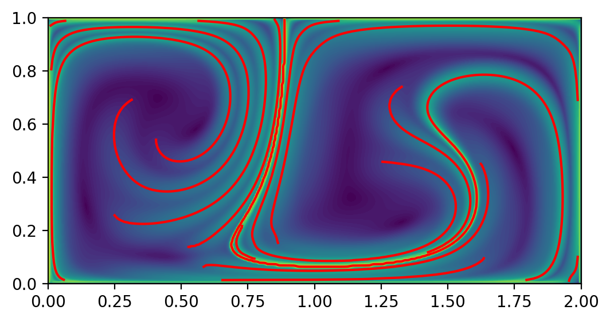
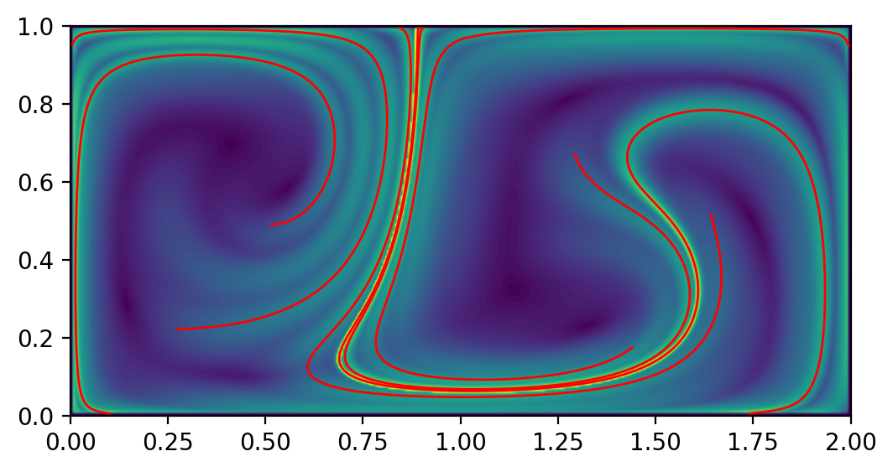
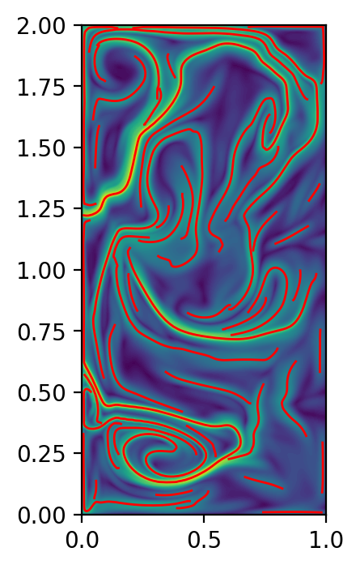
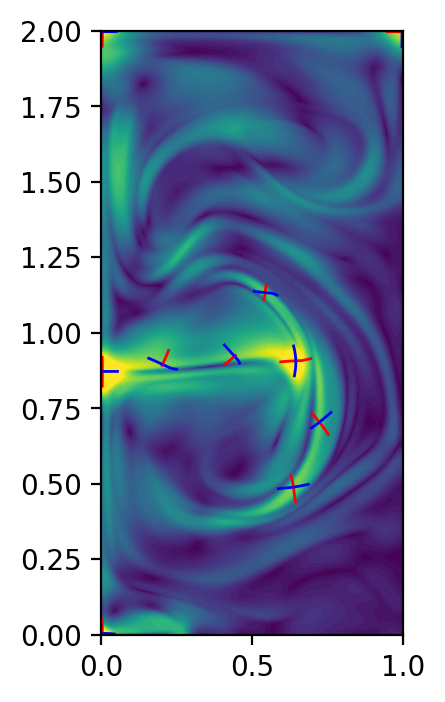
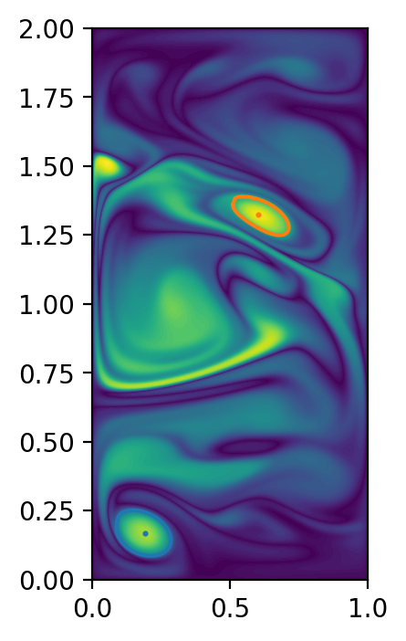

# Summary

`NumbaCS` (Numba Coherent Structures) is a Python package that efficiently
implements a variety of methods for studying material transport in time-dependent
fluid flows. It leverages `Numba` -- a high performance Python compiler
for generating optimized machine code from Python functions -- along with other
`Numba`-compatible packages behind the scenes, producing fast and user-friendly
implementations of coherent structure methods. "Coherent structure methods" refer
to any method which can be used to infer or extract Lagrangian and objective
Eulerian coherent structures. The theory behind these methods have been developed
over the last few decades with the aim of extending many of the important invariant
objects from time-independent dynamical systems theory to the more general setting
where a system may have arbitrary time dependence and may only be known or defined
for some finite time. These time-dependent systems are ubiquitous in the context of
geophysical and engineering flows where the evolution of the velocity field depends
on time and velocity data representing these flows is not available for all time. By
extending the ideas from the time-independent setting to the more general
time-dependent setting, important transient objects (coherent structures) can
be identified which govern how material is transported within a flow.
Understanding material transport in flows is of great importance
for applications ranging from monitoring the transport of a contaminant
in the ocean or atmosphere to informing search and rescue strategies for
persons lost at sea.

# Statement of need

As theory and implementations of coherent structures have been developed [@haller1998; @shadden2005;
@mathur2007; @haller2011; @farazmand2012; @schindler2012; @haller2013;
@haller2016; @serra2016; @nolan2020] and the utility of these tools
has been demonstrated over the last two decades [@dutoit2010; @rutherford2012;
@peacock2013; @serra2017; @liu2018; @nolanpollution2020; @gunther2021;
@pretorius2023; @curbelo2023], there has been a steadily growing
interest in using these methods for real-world applications.
Early on, software implementations were largely contained to in-house packages
developed by applied mathematicians and engineers advancing the theory. Over
the years, there have been a number of software packages developed in an attempt
to provide implementations of some of these methods for practitioners outside
of the field. Some provide a friendly interface for users (`Dynlab` -- @dynlab;
 `LCS MATLAB Kit` -- @lcskit), others aim to provide efficient implementations of
specific methods (sometimes in specific circumstances)
(`Lagrangian` -- @lagrangian; `Newman` -- @dutoitthesis2010;
`Aquila-LCS` --  @lagares2023gpu), and a few implement a variety of methods
(`Tbarrier` -- @tbarrier; `LCS Tool` - @lcstool). NumbaCS intends to unite these aims by providing
efficient and user-friendly implementations of a variety of coherent structure
methods. By doing this, the hope is to provide a powerful tool for experienced
practitioners and a low barrier of entry for newcomers. In addition, as new
methods/implementations arise, the framework laid out in `NumbaCS`
provides a straightforward environment for contributions and maintenance.
Also of note is another package called `CoherentStructures.jl` [@csjl], which is
fast, user-friendly, and implements a variety of methods. This package has some
overlap with `NumbaCS` but they both implement methods which the other does not.
`CoherentStructures.jl` is a powerful tool that should be considered by
users who perhaps prefer Julia to Python or are interested in computing
some of the methods not implemented in `NumbaCS`. For a more detailed breakdown
of how all of the mentioned packages compare with `NumbaCS`, see the
[documentation](https://numbacs.readthedocs.io/en/latest/index.html).

# Functionality

`NumbaCS` implements the following features for both analytical and numerical
flows:

- Standard flow map computation
- Flow map composition method [@brunton2010]
- Finite time Lyapunov exponent (FTLE) [@shadden2005]
- instantaneous Lyapunov exponent (iLE) [@nolan2020]
- Lagrangian averaged vorticity deviation (LAVD) [@haller2016]
- Instantaneous vorticity deviation (IVD) [@haller2016]
- FTLE ridge extraction [@steger1998; @schindler2012]
- Variational hyperbolic LCS [@haller2011; @farazmand2012]
- Variational hyperbolic OECS [@serra2016]
- LAVD-based elliptic LCS [@haller2016]
- IVD-based elliptic OECS [@haller2016]

For flows defined by numerical velocity data:

- Simple creation of JIT compiled linear and cubic interpolants

All of these implementations are relatively straightforward to use and
quite efficient. This is due to three key dependencies `NumbaCS` utilizes to speed
up computations. The first is `Numba` [@numba], a JIT compiler for Python which can
drastically speed up numerical operations and provides a simple framework
for parallelizing tasks. Next, `numbalsoda` [@numbalsoda] is a Python wrapper to
ODE solvers in both C++ (LSODA) and FORTRAN (DOP853) that bypasses the Python
interpreter and can be used within Numba functions (common Python ODE solvers, such
as those provided by the `SciPy` package, cannot be executed within `Numba` functions).
This package is crucial to the efficiency of NumbaCS as particle integration is often
the most costly part of finite-time coherent structure methods. Finally, the `interpolation`
package [@interpolation] provides optimized interpolation in Python and is utilized in
`NumbaCS` to create JIT compiled interpolant functions, producing efficient
implementations of methods even for flows defined by numerical data.
By taking advantage of these packages behind the scenes, `NumbaCS` is able to
maintain the simplicity and readability of an interpreted language while
achieving runtimes closer to that of a compiled language.

# Examples

A [User Guide](https://numbacs.readthedocs.io/en/latest/userguide.html) is
provided which details the workflow in NumbaCS and a number of examples
demonstrating the functionality are covered in the
[Example Gallery](https://numbacs.readthedocs.io/en/latest/auto_examples/index.html).
Here we show the output of a few examples, provide the runtime of each, and
breakdown the runtime based on the parts of each method. "Flowmap" refers to
the particle integration step, "C eig" and "S eig" refer to the eigenvalue/vector
step for Lagrangian and Eulerian methods respectively (this time will be
roughly equal to the FTLE and iLE times), and the last is the extraction time
for a given method. For examples that require
particle integration, the default solver (DOP853) was used with the default
error tolerances (relative tolerance = 1e-6, absolute tolerance = 1e-8).
All runs were performed on an
Intel^(R)^ Core^TM^ i7-3770K CPU @ 3.50GHz (which has 4 cores and 8 total threads).
Warm-up time[^1] is not included in the timings.

[^1]: Since many functions in `NumbaCS` are JIT compiled, these functions are
optimized and compiled into machine code on the first function call. This
initial delay is often referred to as "warm-up time". After the first call,
subsequent function calls are much faster.

**Analytical Flow (Double Gyre)**

{ width=50% }
{ width=50% }

Left: [DG FTLE ridges](https://numbacs.readthedocs.io/en/latest/auto_examples/ftle/plot_dg_ftle_ridges.html#sphx-glr-auto-examples-ftle-plot-dg-ftle-ridges-py)
at t~0~ = 0, integration time T = -10. Total runtime per
iterate: ~0.424s (flowmap: ~0.390s; C eig: ~0.025s; FTLE ridge extraction: ~0.009s).
Right: [DG hyperbolic LCS](https://numbacs.readthedocs.io/en/latest/auto_examples/hyp_lcs/plot_dg_hyp_lcs.html#sphx-glr-auto-examples-hyp-lcs-plot-dg-hyp-lcs-py)
at t~0~ = 0, integration time T = -10. Total runtime per
iterate: ~5.219s (flowmap (aux grid): ~1.83s; C eig (aux grid): ~0.039s;
hyperbolic LCS extraction: ~3.350s). Both are computed over a 401x201 grid.

**Analytical Flow (Bickley jet)**

{ width=95% }

[Bickley jet elliptic LCS](https://numbacs.readthedocs.io/en/latest/auto_examples/elliptic_lcs/plot_bickley_elliptic_lcs.html#sphx-glr-auto-examples-elliptic-lcs-plot-bickley-elliptic-lcs-py)
at t~0~ = 0, integration time T = 40 days. Total runtime per
iterate: ~9.200s (flowmap: ~5.050s; LAVD: ~4.140s; elliptic LCS extraction: ~0.010s).
Computed over 482x121 grid.

\newpage

**Numerical Flow (QGE)**

{ width=33% }
{ width=33% }
{ width=33% }

Left: [QGE FTLE ridges](https://numbacs.readthedocs.io/en/latest/auto_examples/ftle/plot_qge_ftle_ridges.html#sphx-glr-auto-examples-ftle-plot-qge-ftle-ridges-py)
 at t~0~ = 0, integration time T = 0.1. Total runtime per
iterate: ~2.461s (flowmap: ~2.400s; C eig: ~0.038s; FTLE ridge extraction: ~0.023s).
Middle: [QGE hyperbolic OECS](https://numbacs.readthedocs.io/en/latest/auto_examples/hyp_oecs/plot_qge_hyp_oecs.html#sphx-glr-auto-examples-hyp-oecs-plot-qge-hyp-oecs-py)
at t~0~ = 0.15. Total runtime per
iterate: ~2.238s (S eig: ~0.038s; hyperbolic OECS extraction: ~2.200s).
Right: [QGE elliptic OECS](https://numbacs.readthedocs.io/en/latest/auto_examples/elliptic_oecs/plot_qge_elliptic_oecs.html#sphx-glr-auto-examples-elliptic-oecs-plot-qge-elliptic-oecs-py)
at t~0~ = 0.5. Total runtime per iterate: ~0.0452s
(IVD: ~0.0002s; elliptic OECS extraction: ~0.045s).
All are computed over a 257x513 grid.

**Numerical Flow (MERRA-2)**

{ width=95% }

[MERRA-2 FTLE ridges](https://numbacs.readthedocs.io/en/latest/auto_examples/ftle/plot_merra_ftle_ridges.html#sphx-glr-auto-examples-ftle-plot-merra-ftle-ridges-py)
at t~0~ = 06/16/2020-00:00, integration time T = -72hrs.
Total runtime per iterate: ~7.835s (flowmap: ~7.480s; C eig: ~0.085s;
FTLE ridge extraction: ~0.27s). Computed over 902x335 grid.

# Datasets

Two datasets are provided with NumbaCS to test the functionality for flows
defined by numerical velocity data. One is a numerical simulation of the
quasi-geostrophic equations (QGE). We thank the authors of @mou2021 for providing
us with this dataset, which was used extensively during development, and allowing
a piece of the dataset to be included in the package. The full dataset was over
the time span [10,81] with dt = 0.01. We provide the velocity fields over the
much shorter time span of [10,11] with the same dt. For details on parameters
used in the simulation, refer to the cited paper. The other dataset is a MERRA-2
vertically averaged reanalysis dataset [@merra2; @merra_file], which was used as
part of a paper [@jarvis2024] coauthored by the authors of this paper. Wind
velocity fields were vertically averaged over pressure surfaces ranging from
500 hPa to 800 hPa. The corresponding latitude, longitude, and
date arrays are also provided. All data can be downloaded from the
[data folder](https://github.com/alb3rtjarvis/numbacs/tree/main/examples/data)
on the GitHub page.

# Usage in ongoing research

As of the writing of this paper, `NumbaCS` has not been public for long but has
been utilized in one publication [@jarvis2024] where it was the computational
tool for all coherent structure methods. In addition, it is currently being used
in an ongoing project focused on airborne invasive species traveling from Australia
to New Zealand titled
["Protecting Aotearoa from wind-dispersed pests"](https://www.scionresearch.com/science/managing-forestry-risk-and-climate-change/protecting-our-forests-from-pests-and-diseases/aerial-invaders-research-programme). This is a five year (October 2023 - October 2028) Scion-led and
Ministry of Business, Innovation and Employment (MBIE)-supported program.

# Acknowledgments

This work was partially supported by the National Science Foundation (NSF) under
grant number 1821145 and the National Aeronautics and Space Administration
(NASA) under grant number 80NSSC20K1532 issued through the Interdisciplinary
Research in Earth Science (IDS) and Biological Diversity & Ecological
Conservation programs.

# References
